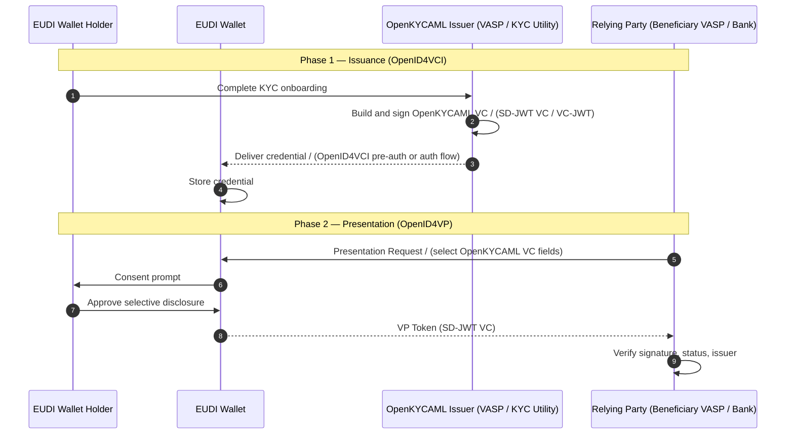
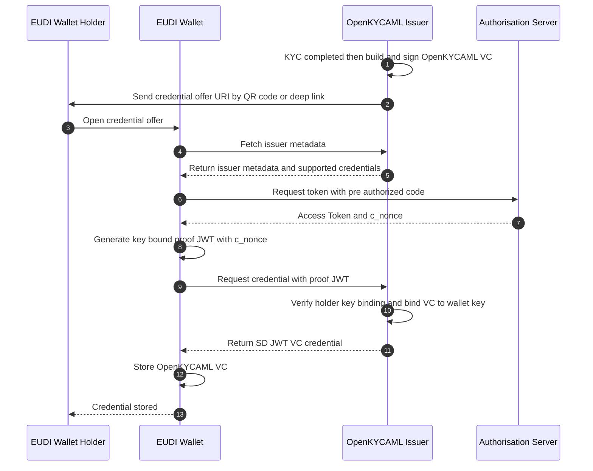
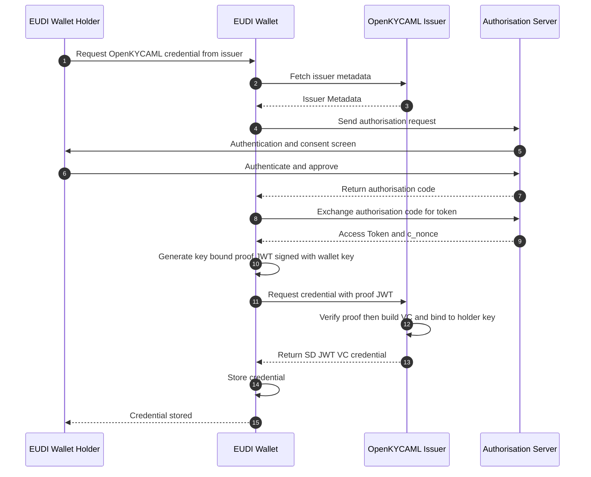
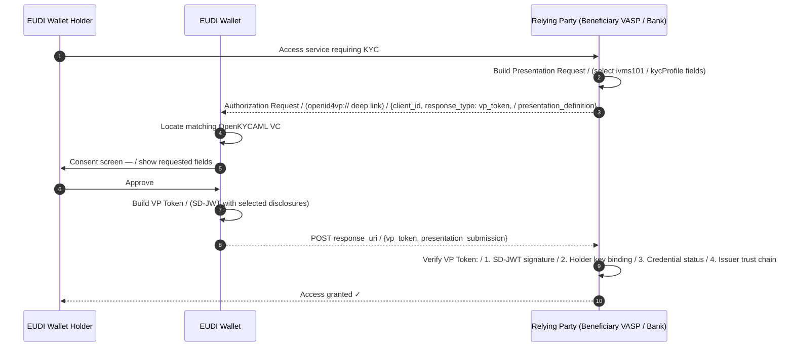
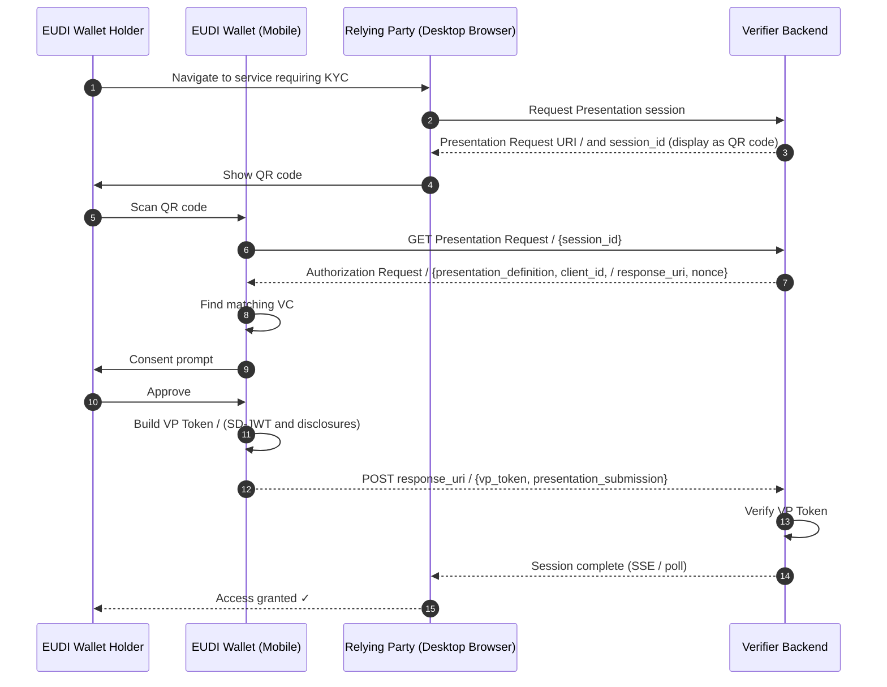
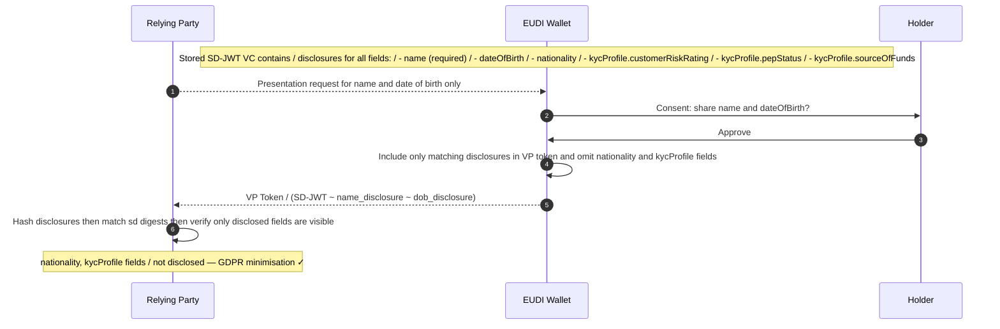
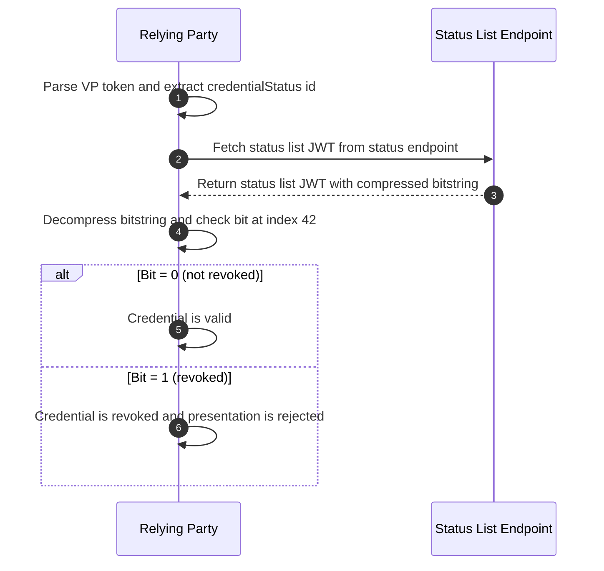
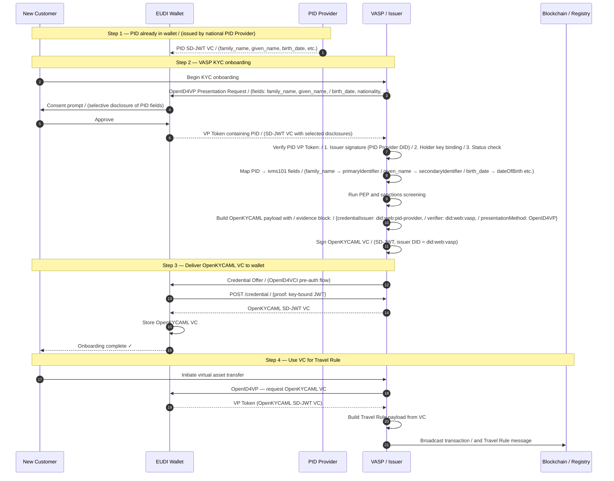

# eIDAS 2.0 VC Issuance and Presentation Flows — Sequence Diagrams

This document contains Mermaid sequence diagrams for the eIDAS 2.0 OpenKYCAML Verifiable Credential lifecycle: issuance via **OpenID4VCI** and presentation via **OpenID4VP**.

For narrative integration guidance, see the [EUDI Wallet Integration Guide](../guides/eudi-wallet-integration.md).

---

## Table of Contents

1. [Overview: OpenKYCAML VC Lifecycle](#1-overview-openkycaml-vc-lifecycle)
2. [VC Issuance — OpenID4VCI Pre-Authorised Code Flow](#2-vc-issuance--openid4vci-pre-authorised-code-flow)
3. [VC Issuance — OpenID4VCI Authorisation Code Flow](#3-vc-issuance--openid4vci-authorisation-code-flow)
4. [VC Presentation — OpenID4VP (Same-Device)](#4-vc-presentation--openid4vp-same-device)
5. [VC Presentation — OpenID4VP (Cross-Device / QR Code)](#5-vc-presentation--openid4vp-cross-device--qr-code)
6. [SD-JWT Selective Disclosure Flow](#6-sd-jwt-selective-disclosure-flow)
7. [Credential Status Check (StatusList2021)](#7-credential-status-check-statuslist2021)
8. [PID-Backed OpenKYCAML Issuance (Full EUDI Wallet Onboarding)](#8-pid-backed-openkycaml-issuance-full-eudi-wallet-onboarding)

---

## 1. Overview: OpenKYCAML VC Lifecycle

---

## 2. VC Issuance — OpenID4VCI Pre-Authorised Code Flow

Used when the issuer pre-approves the credential offer (e.g., after in-person or online KYC). The EUDI Wallet scans a QR code or deep-links to the credential offer URI.

---

## 3. VC Issuance — OpenID4VCI Authorisation Code Flow

Used when the holder must authenticate with the issuer before receiving the credential (e.g., existing customer account login).

---

## 4. VC Presentation — OpenID4VP (Same-Device)

Used when the verifier and the EUDI Wallet are on the same device (e.g., browser and mobile wallet via universal link).

---

## 5. VC Presentation — OpenID4VP (Cross-Device / QR Code)

Used when the relying party is on a desktop browser and the EUDI Wallet is on the holder's mobile device.

---

## 6. SD-JWT Selective Disclosure Flow

Illustrates how the EUDI Wallet selectively discloses only the fields requested by the verifier, protecting GDPR-sensitive fields not required for the use case.

---

## 7. Credential Status Check (StatusList2021)

Shows the revocation check flow using W3C Status List 2021, which is embedded in the `credentialStatus` field of the OpenKYCAML VC.

---

## 8. PID-Backed OpenKYCAML Issuance (Full EUDI Wallet Onboarding)

End-to-end flow for a new customer who uses their eIDAS 2.0 PID (Personal Identification Data) credential to onboard with a VASP. The VASP verifies the PID and issues an OpenKYCAML VC back to the wallet, recording the evidence chain.

---

*All diagrams are rendered with [Mermaid](https://mermaid.js.org/). For the Travel Rule protocol-specific flows, see [Travel Rule Sequence Diagrams](travel-rule-sequence-diagrams.md). Last updated: v1.12.0.*
