```mermaid
erDiagram
    OpenKYCAMLDocument {
        string schemaVersion
        string messageId
        string messageDateTime
        string messageType
    }

    IVMS101Payload {
        string transactionIdentifier
        string timestamp
        string version
        string amount
        string assetType
    }

    Originator {
        string accountNumber
    }

    Beneficiary {
        string accountNumber
    }

    VASP {
        string name
        string vaspIdentifier
        string lei
    }

    NaturalPerson {
        string customerIdentification
        string countryOfResidence
        string nationality
        string emailAddress
        string phoneNumber
        string mobileNumber
        string gender
        string occupationCode
        string occupationDescription
    }

    LegalPerson {
        string customerNumber
        string lei
        string countryOfRegistration
        string emailAddress
        string phoneNumber
        string mobileNumber
    }

    NaturalPersonNameIdentifier {
        string primaryIdentifier
        string secondaryIdentifier
        string nameIdentifierType
    }

    LegalPersonNameIdentifier {
        string legalPersonName
        string legalPersonNameIdentifierType
    }

    Address {
        string addressType
        string streetName
        string buildingNumber
        string townName
        string postCode
        string country
    }

    NationalIdentification {
        string nationalIdentifier
        string nationalIdentifierType
        string countryOfIssue
        string registrationAuthority
    }

    DateAndPlaceOfBirth {
        string dateOfBirth
        string placeOfBirth
    }

    LegalPersonIdentificationData {
        string currentLegalName
        string uniqueIdentifier
        string vatRegistrationNumber
        string taxReferenceNumber
        string europeanUniqueIdentifier
        string lei
        string eoriNumber
    }

    VerifiableCredentialWrapper {
        string id
        string validFrom
        string validUntil
    }

    VerifiableCredentialProof {
        string type
        string created
        string verificationMethod
        string proofPurpose
        string proofValue
        string jws
    }

    KYCProfile {
        string customerRiskRating
        string dueDiligenceType
        string onboardingChannel
        string kycCompletionDate
        string jurisdictionOfService
    }

    PEPStatus {
        boolean isPEP
        string pepCategory
        string pepRole
        string screeningDate
        string screeningProvider
    }

    SanctionsScreening {
        string screeningStatus
        string screeningDate
        string screeningProvider
    }

    AdverseMedia {
        boolean hasHits
        string screeningStatus
        string screeningDate
        string screeningProvider
        string summary
    }

    SourceOfFundsWealth {
        string verificationStatus
        string sourceOfWealthNarrative
    }

    BeneficialOwner {
        number ownershipPercentage
        string ownershipType
        string controlMechanism
        string verificationDate
        boolean isPEP
        integer ownershipChainDepth
    }

    MonitoringInfo {
        string monitoringLevel
        string monitoringStatus
        boolean eddRequired
        string lastReviewDate
        string nextReviewDate
        string reviewFrequency
    }

    AuditMetadata {
        string recordId
        string recordCreatedAt
        string recordUpdatedAt
        integer recordVersion
        string createdBy
        string dataSourceSystem
        string dataProvider
        string dataRetentionDate
    }

    GdprSensitivityMetadata {
        string classification
        boolean tippingOffProtected
        string legalBasis
        string retentionPeriod
        string auditReference
    }

    SelectiveDisclosure {
        string sd_alg
    }

    %% Root document contains the main payload blocks
    OpenKYCAMLDocument ||--o| IVMS101Payload : "ivms101"
    OpenKYCAMLDocument ||--o| VerifiableCredentialWrapper : "verifiableCredential"

    %% IVMS 101 composition
    IVMS101Payload ||--|| Originator : "originator"
    IVMS101Payload ||--|| Beneficiary : "beneficiary"
    IVMS101Payload ||--|| VASP : "originatingVASP"
    IVMS101Payload ||--|| VASP : "beneficiaryVASP"
    IVMS101Payload ||--o{ VASP : "transferPath"

    %% Originator / Beneficiary persons
    Originator ||--o{ NaturalPerson : "originatorPersons.naturalPerson"
    Originator ||--o{ LegalPerson : "originatorPersons.legalPerson"
    Beneficiary ||--o{ NaturalPerson : "beneficiaryPersons.naturalPerson"
    Beneficiary ||--o{ LegalPerson : "beneficiaryPersons.legalPerson"

    %% NaturalPerson sub-entities
    NaturalPerson ||--o{ NaturalPersonNameIdentifier : "name.nameIdentifier"
    NaturalPerson ||--o{ Address : "geographicAddress"
    NaturalPerson ||--o| NationalIdentification : "nationalIdentification"
    NaturalPerson ||--o| DateAndPlaceOfBirth : "dateAndPlaceOfBirth"

    %% LegalPerson sub-entities
    LegalPerson ||--o{ LegalPersonNameIdentifier : "name.nameIdentifier"
    LegalPerson ||--o{ Address : "geographicAddress"
    LegalPerson ||--o| NationalIdentification : "nationalIdentification"
    LegalPerson ||--o| LegalPersonIdentificationData : "lpid"

    %% LegalPersonIdentificationData sub-entities
    LegalPersonIdentificationData ||--o| Address : "currentAddress"
    LegalPersonIdentificationData ||--o{ NaturalPerson : "mandates.naturalPerson"

    %% VC Wrapper composition
    VerifiableCredentialWrapper ||--o| IVMS101Payload : "credentialSubject.ivms101"
    VerifiableCredentialWrapper ||--o| KYCProfile : "credentialSubject.kycProfile"
    VerifiableCredentialWrapper ||--o| LegalPersonIdentificationData : "credentialSubject.lpid"
    VerifiableCredentialWrapper ||--o| VerifiableCredentialProof : "proof"
    VerifiableCredentialWrapper ||--o| SelectiveDisclosure : "selectiveDisclosure"

    %% KYC Profile composition
    KYCProfile ||--o| PEPStatus : "pepStatus"
    KYCProfile ||--o| SanctionsScreening : "sanctionsScreening"
    KYCProfile ||--o| AdverseMedia : "adverseMedia"
    KYCProfile ||--o| SourceOfFundsWealth : "sourceOfFundsWealth"
    KYCProfile ||--o{ BeneficialOwner : "beneficialOwnership"
    KYCProfile ||--o| MonitoringInfo : "monitoringInfo"
    KYCProfile ||--o| AuditMetadata : "auditMetadata"
    KYCProfile ||--o| GdprSensitivityMetadata : "gdprSensitivityMetadata"
    KYCProfile ||--o| DueDiligenceRequirements : "dueDiligenceRequirements"
    KYCProfile ||--o| ThirdPartyCDDReliance : "thirdPartyCDDReliance"
    KYCProfile ||--o{ BlockchainAccountId : "blockchainAccountIds"

    %% BlockchainAccountId sub-objects (v1.3.0–v1.7.0)
    BlockchainAccountId {
        string address
        string network
        string onchainIDAddress
        string xrplCredentialType
        string mptIssuanceId
        string xrplPermissionedDomainId
        string xrplFreezeType
        boolean xrplClawbackEnabled
        integer mptFlags
        string lightningNodePubkey
        string bitcoinScriptType
    }
    BlockchainAccountId ||--o| XrplConfidentialTransfer : "xrplConfidentialTransfer"

    XrplConfidentialTransfer {
        boolean enabled
        string encryptionScheme
        string auditorPublicKey
        string regulatorPublicKey
    }

    %% BeneficialOwner references persons
    BeneficialOwner ||--o| NaturalPerson : "person.naturalPerson"
    BeneficialOwner ||--o| LegalPerson : "person.legalPerson"
    BeneficialOwner ||--o{ LegalPerson : "intermediateEntities.legalPerson"

    %% LegalPerson typed sub-objects (v1.4.0)
    LegalPerson ||--o| TrustDetails : "trustDetails"
    LegalPerson ||--o| FoundationDetails : "foundationDetails"
    LegalPerson ||--o| PartnershipDetails : "partnershipDetails"

    TrustDetails { string settlor string trustee string protector }
    FoundationDetails { string founder string councilMember }
    PartnershipDetails { string generalPartner string limitedPartner }

    %% VerificationDocumentBundle (v1.5.0)
    OpenKYCAMLDocument ||--o| VerificationDocumentBundle : "identityDocuments"
    VerificationDocumentBundle ||--o{ NaturalPersonDocument : "naturalPersonDocuments"
    VerificationDocumentBundle ||--o{ LegalEntityDocument : "legalEntityDocuments"

    NaturalPersonDocument {
        string documentType
        string documentId
        string issuingCountry
        string expiryDate
    }
    NaturalPersonDocument ||--o{ ExtractedAttribute : "extractedAttributes"

    LegalEntityDocument {
        string documentType
        string documentId
        string issuingAuthority
    }
    LegalEntityDocument ||--o| RegistrationAuthorityDetail : "registrationAuthorityDetail"
    LegalEntityDocument ||--o{ ExtractedAttribute : "extractedAttributes"

    ExtractedAttribute { string fieldName string value boolean matchesRecord }
    RegistrationAuthorityDetail { string ralCode string authorityName string jurisdiction }

    %% TaxStatus block (v1.9.0-v1.9.1)
    OpenKYCAMLDocument ||--o| TaxStatus : "taxStatus"
    TaxStatus ||--o{ TinIdentifier : "tinIdentifiers"
    TaxStatus ||--o{ IndirectTaxRegistration : "indirectTaxRegistrations"
    TaxStatus ||--o| EconomicSubstance : "economicSubstance"
    TaxStatus ||--o| PillarTwo : "pillarTwo"
    TaxStatus ||--o{ CrsTaxResidency : "crsTaxResidencies"
    TaxStatus ||--o| FatcaStatus : "fatcaStatus"

    TinIdentifier { string jurisdiction string tinType string tinValue string verificationStatus }
    IndirectTaxRegistration { string taxType string jurisdiction string registrationNumber string status }
    EconomicSubstance { string jurisdiction string status boolean coreIncomeGeneratingActivitiesPerformed }
    PillarTwo { boolean inScopeMNE number consolidatedRevenueEUR string constituentEntityStatus string girFilingReference }
    CrsTaxResidency { string jurisdiction string tinValue string tinVerificationStatus boolean controllingPersonFlag }
    FatcaStatus { string giin string chapter4Classification boolean usTinRequired boolean temporaryReliefApplied string ffiListVerificationTimestamp }

    %% BankingDetails (v1.10.0)
    NaturalPerson ||--o{ BankingDetails : "bankingDetails"
    LegalPerson ||--o{ BankingDetails : "bankingDetails"

    BankingDetails { string iban string bic string bankName string accountCurrency string accountType string bankingCountry }

    %% Cell Company structures (v1.11.0)
    LegalPerson ||--o| CellCompanyDetails : "cellCompanyDetails"
    LegalPerson ||--o| ParentCellCompanyReference : "parentCellCompanyReference"

    CellCompanyDetails { string cellCompanyType string cellIdentifier string cellName string cellRegistrationNumber boolean hasIndependentLegalPersonality boolean isCellCompanyIssuer string issuancePurpose }
    ParentCellCompanyReference { string legalEntityIdentifier string jurisdiction string parentName }

    %% Entity Governance (v1.12.0)
    LegalPerson ||--o| EntityGovernance : "entityGovernance"
    EntityGovernance ||--o{ RegulatorEntry : "regulators"
    EntityGovernance ||--o| ListedStatus : "listedStatus"
    EntityGovernance ||--o| ParentCellCompanyReference : "parentCompany"

    EntityGovernance { string regulatoryStatus boolean parentRegulated boolean parentListed boolean majorityOwnedSubsidiary boolean stateOwned number governmentOwnershipPercentage }
    RegulatorEntry { string regulatorName string jurisdiction string licenceNumber }
    ListedStatus { boolean isListed string marketIdentifier boolean recognisedMarket }

    %% Review Lifecycle (v1.12.0)
    MonitoringInfo ||--o| ReviewLifecycle : "reviewLifecycle"
    ReviewLifecycle ||--o{ ReviewLifecycleHistory : "stateHistory"

    ReviewLifecycle { string currentState }
    ReviewLifecycleHistory { string fromState string toState string transitionAt string reason string actor }
```

# OpenKYCAML Full Schema — Entity-Relationship Diagram

This document presents a Mermaid entity-relationship diagram of the complete OpenKYCAML v1.7.0 schema. Each box represents a `$defs` entity or top-level object; relationships show `$ref` references and composition.

---

---

## Entity Descriptions

| Entity | Description |
|---|---|
| `OpenKYCAMLDocument` | Root document envelope. At least one of `ivms101` or `verifiableCredential` must be present. |
| `IVMS101Payload` | IVMS 101 Travel Rule message payload (FATF Rec 16 / TFR 2023). |
| `Originator` | Sending party in a virtual asset transfer. |
| `Beneficiary` | Receiving party in a virtual asset transfer. |
| `VASP` | Virtual Asset Service Provider identifier. |
| `NaturalPerson` | IVMS 101 natural person entity (individual). |
| `LegalPerson` | IVMS 101 legal person entity (company/organisation). Has optional `trustDetails`, `foundationDetails`, and `partnershipDetails` sub-objects (v1.4.0). |
| `NaturalPersonNameIdentifier` | Structured name for a natural person (family/given names). |
| `LegalPersonNameIdentifier` | Registered name for a legal person. |
| `Address` | Structured postal address (IVMS 101 §3.5). |
| `NationalIdentification` | National identification document (passport, LEI, etc.). |
| `DateAndPlaceOfBirth` | Birth information for a natural person. |
| `LegalPersonIdentificationData` | eIDAS 2.0 LPID block for legal entities. |
| `VerifiableCredentialWrapper` | W3C Verifiable Credential envelope (VC Data Model v2). |
| `VerifiableCredentialProof` | Cryptographic proof (Ed25519, JsonWebSignature2020, etc.). |
| `SelectiveDisclosure` | SD-JWT selective disclosure metadata. |
| `KYCProfile` | KYC/AML profile — risk rating, screening results, UBO chain, blockchain wallet identifiers. |
| `PEPStatus` | Politically Exposed Person screening result. |
| `SanctionsScreening` | Sanctions list screening result. |
| `AdverseMedia` | Adverse media / negative news screening result. |
| `SourceOfFundsWealth` | Declared and verified source of funds and wealth. |
| `BeneficialOwner` | Ultimate Beneficial Owner (UBO) record with ownership chain. |
| `MonitoringInfo` | Ongoing AML monitoring metadata and alerts. |
| `AuditMetadata` | Audit trail and provenance metadata. |
| `GdprSensitivityMetadata` | GDPR/AML sensitivity classification and tipping-off protection. |
| `DueDiligenceRequirements` | AMLA RTS-aligned CDD tier requirements record (v1.2.0). |
| `ThirdPartyCDDReliance` | Third-party CDD reliance record with responsible party and SLA (v1.2.0). |
| `BlockchainAccountId` | Blockchain wallet address entry with network, ONCHAINID, freeze state, XRPL credential type, MPT issuance ID, Permissioned Domain (XLS-80), Confidential Transfer (XLS-96), freeze type (XLS-77), clawback, Lightning/Bitcoin fields (v1.3.0–v1.7.0). |
| `XrplConfidentialTransfer` | XLS-96 Confidential Transfer configuration — enabled flag, EC-ElGamal scheme, auditor and regulator public keys (v1.7.0). |
| `TrustDetails` | Typed sub-object for trust entities — settlor, trustee, protector, beneficiary class (v1.4.0). |
| `FoundationDetails` | Typed sub-object for foundation entities — founders, council members (v1.4.0). |
| `PartnershipDetails` | Typed sub-object for partnership entities — general and limited partners (v1.4.0). |
| `VerificationDocumentBundle` | Root container for verification documents associated with the KYC record (v1.5.0). |
| `NaturalPersonDocument` | Individual identity document (passport, driving licence, PID VC, etc.) with document ID URN (v1.5.0–v1.6.0). |
| `LegalEntityDocument` | Corporate document (certificate of incorporation, LEI registration, vLEI VC, etc.) with document ID URN (v1.5.0–v1.6.0). |
| `ExtractedAttribute` | Per-document field extraction result with `matchesRecord` flag (v1.5.0). |
| `RegistrationAuthorityDetail` | Structured GLEIF RAL reference with `ralCode`, authority name, and jurisdiction (v1.5.0). |
| `TaxStatus` | Root tax status block (v1.9.0+). Contains tinIdentifiers[], indirectTaxRegistrations[], economicSubstance, pillarTwo, crsTaxResidencies[], and fatcaStatus. |
| `TinIdentifier` | A single jurisdiction-specific TIN entry (v1.9.0). Supports OECD CRS/CARF, FATCA EIN, and functional equivalents. |
| `IndirectTaxRegistration` | VAT/GST/PST/HST/salesTax registration entry with status and effectiveFrom date (v1.9.0). |
| `EconomicSubstance` | ESR status block for BVI/Cayman/UAE/Jersey/Guernsey/IoM entities; `nonCompliant` status triggers EDD warning (v1.9.0). |
| `PillarTwo` | OECD Pillar 2 GloBE constituent entity block with ETR per jurisdiction and GIR reference (v1.9.0). |
| `CrsTaxResidency` | Enhanced per-jurisdiction CRS self-certification entry with TIN verification status and controlling-person flag (v1.9.1). |
| `FatcaStatus` | US FATCA Chapter 4 first-class block: GIIN (19-char IRS regex), Chapter 4 classification, FFI List verification timestamp, Notice 2024-78 relief flag (v1.9.1). |
| `BankingDetails` | Validated banking account details — IBAN (ISO 13616), BIC (ISO 9362), account currency (ISO 4217), account type classification, and banking country. Wired as `bankingDetails[]` on both `NaturalPerson` and `LegalPerson` (v1.10.0). |
| `CellCompanyType` | Enum classifying a LegalPerson as a non-cell entity (NONE), PCC Core, PCC Cell, ICC Core, or ICC Cell (v1.11.0). |
| `CellCompanyDetails` | Structured metadata for PCC/ICC cells: cell type, identifier, name, registration number (ICC cells), legal personality flag, issuer flag, issuance purpose, and instrument URI (v1.11.0). |
| `ParentCellCompanyReference` | Mandatory parent link for any cell — LEI or registration number + jurisdiction of the parent PCC/ICC Core (v1.11.0). Also reused by `EntityGovernance.parentCompany` for non-cell corporate groups (v1.12.0). |
| `EntityGovernance` | Entity governance flags for LegalPerson: `regulatoryStatus` enum, `regulators[]` array, `listedStatus`, `parentCompany`, `parentRegulated`, `parentListed`, `majorityOwnedSubsidiary`, `stateOwned`, `governmentOwnershipPercentage` (v1.12.0). |
| `RegulatorEntry` | Single regulator in `EntityGovernance.regulators[]`: regulator name, ISO 3166-1 alpha-2 jurisdiction, licence number (v1.12.0). |
| `ListedStatus` | Stock exchange listing status: `isListed`, ISO 10383 `marketIdentifier` (MIC code), `recognisedMarket` boolean (v1.12.0). |
| `ReviewLifecycle` | KYC/AML review lifecycle state machine wired to `MonitoringInfo`: `currentState` enum and `stateHistory[]` audit trail (v1.12.0). |
| `ReviewLifecycleHistory` | Single state-transition entry: `fromState`, `toState`, `transitionAt` timestamp, optional `reason` and `actor` (v1.12.0). |

---

*Diagram generated from OpenKYCAML schema v1.12.0. Last updated: v1.12.0.*
