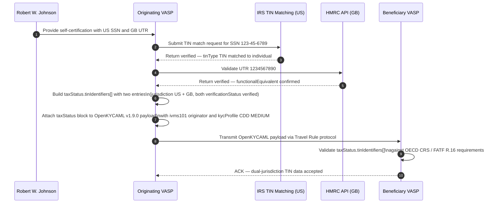
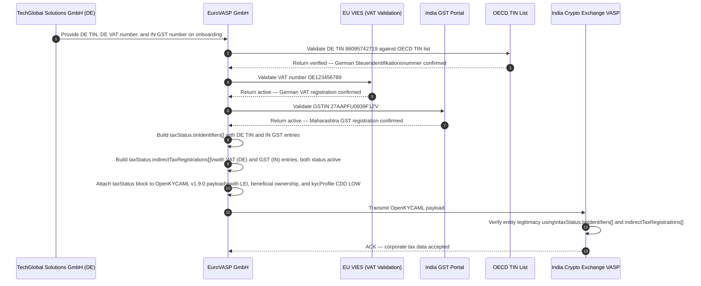
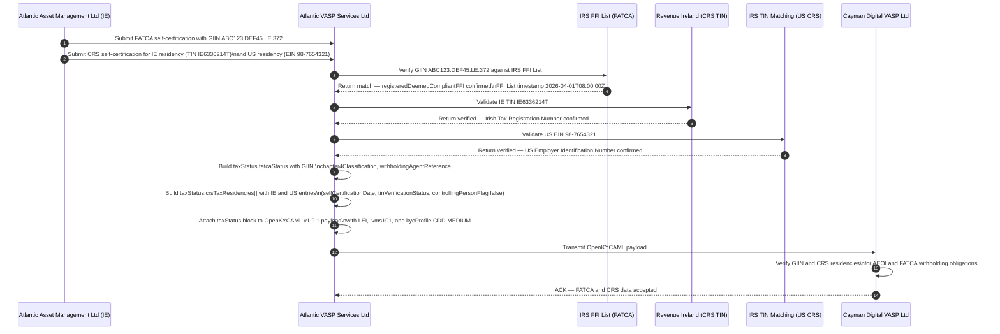
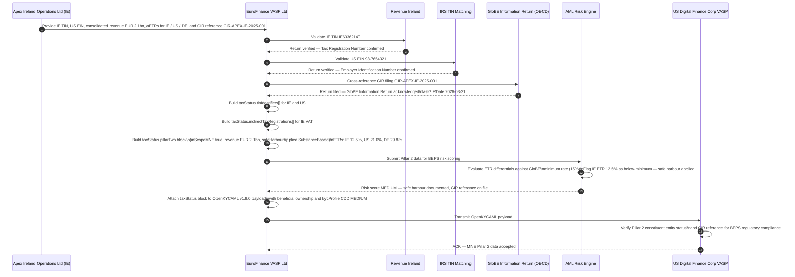
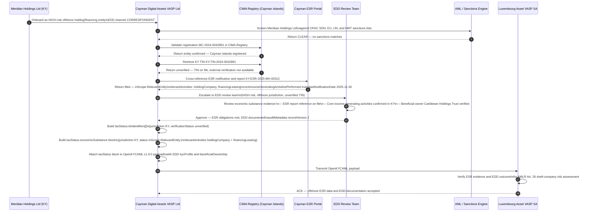

# Tax Status — Mermaid Diagrams

This document contains Mermaid diagrams illustrating the five Tax Status example scenarios supported by OpenKYCAML v1.9.x. Each diagram corresponds to a JSON example file in `examples/tax/`.

For field-level mapping details, see:
- [Tax Status, TIN, ESR & Pillar 2 GloBE Mapping](../mappings/tax-status-oecd-esr-pillar2.md)
- [FATCA & CRS Mapping](../mappings/fatca-crs.md)

---

## Table of Contents

1. [Individual TIN Verification Flow](#1-individual-tin-verification-flow)
2. [Corporate VAT/GST Registration Flow](#2-corporate-vatgst-registration-flow)
3. [FATCA/CRS Compliance Flow](#3-fatcacrs-compliance-flow)
4. [MNE Pillar 2 GloBE Compliance Flow](#4-mne-pillar-2-globe-compliance-flow)
5. [Offshore Economic Substance (ESR) EDD Flow](#5-offshore-economic-substance-esr-edd-flow)

---

## 1. Individual TIN Verification Flow

**Example:** [`examples/tax/tax-individual-tin.json`](../../examples/tax/tax-individual-tin.json)

A natural person (Robert William Johnson) holds tax residency in two jurisdictions — the United States (SSN) and the United Kingdom (UTR). The VASP verifies both TINs via the respective revenue authority APIs before publishing the OpenKYCAML payload.

---

## 2. Corporate VAT/GST Registration Flow

**Example:** [`examples/tax/tax-corporate-vat-gst.json`](../../examples/tax/tax-corporate-vat-gst.json)

A German legal entity (TechGlobal Solutions GmbH) trading with an Indian counterparty holds both a German income-tax TIN and an Indian GST registration. The VASP validates entity legitimacy via EU VIES and the Indian GST portal before building the OpenKYCAML payload.

---

## 3. FATCA/CRS Compliance Flow

**Example:** [`examples/tax/tax-fatca-crs.json`](../../examples/tax/tax-fatca-crs.json)

An Irish-registered financial institution (Atlantic Asset Management Ltd) is a Registered Deemed-Compliant FFI under FATCA and holds dual CRS tax residency in Ireland and the US. The VASP verifies the GIIN against the IRS FFI List and captures CRS self-certifications before transmitting the OpenKYCAML v1.9.1 payload.

---

## 4. MNE Pillar 2 GloBE Compliance Flow

**Example:** [`examples/tax/tax-mne-pillar2.json`](../../examples/tax/tax-mne-pillar2.json)

Apex Ireland Operations Ltd is a constituent entity of a multinational group (Apex International Group PLC) with consolidated revenue exceeding EUR 750 million. The VASP captures Pillar 2 GloBE effective tax rates across three jurisdictions and links the GloBE Information Return (GIR) filing reference for AML risk-scoring purposes.

---

## 5. Offshore Economic Substance (ESR) EDD Flow

**Example:** [`examples/tax/tax-offshore-esr.json`](../../examples/tax/tax-offshore-esr.json)

Meridian Holdings Ltd is a Cayman Islands holding and financing entity subject to the Cayman Islands Economic Substance Act. The entity is flagged as HIGH risk and subject to Enhanced Due Diligence (EDD). The VASP captures economic substance evidence and ESR notification/report references before approving the transaction.

