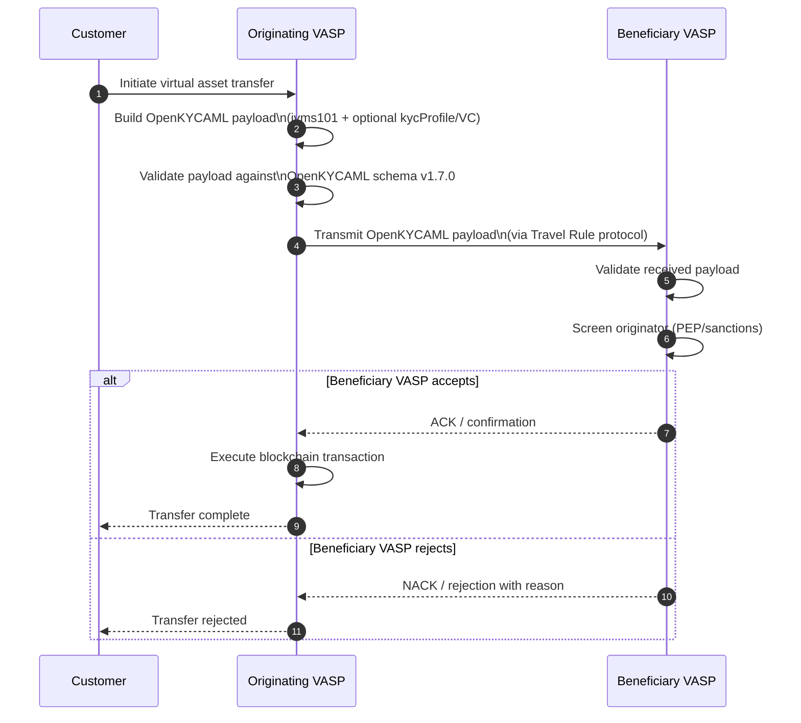
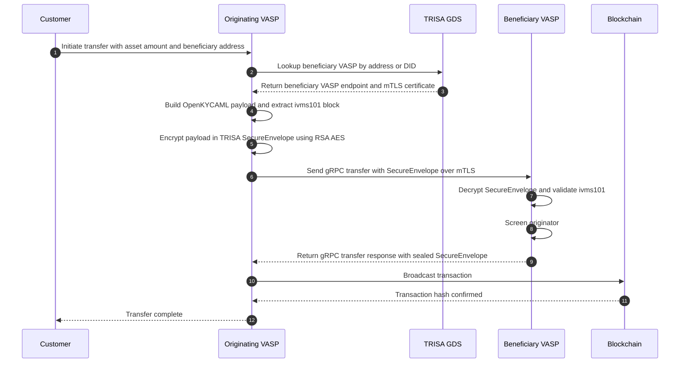
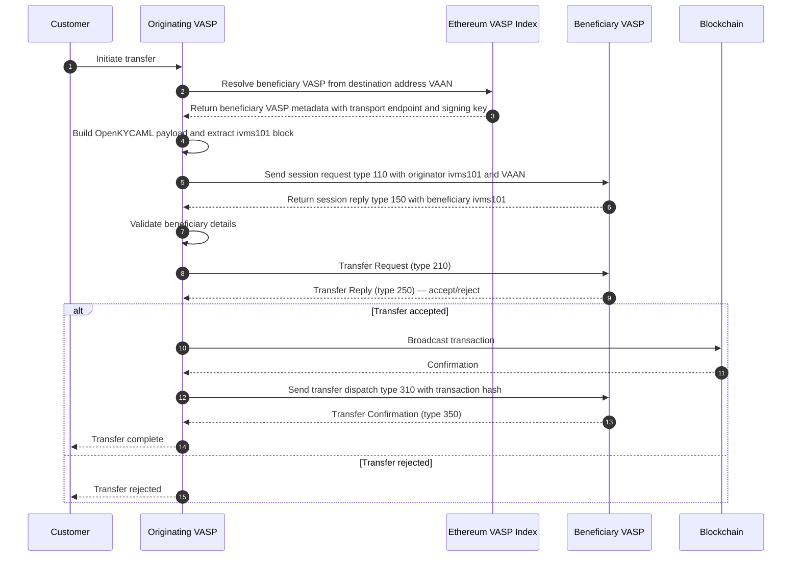
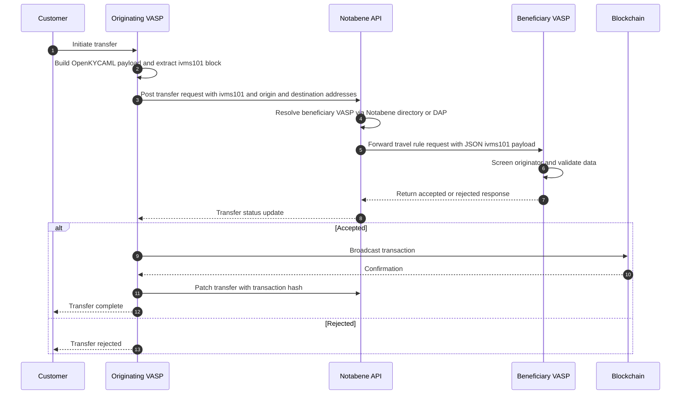
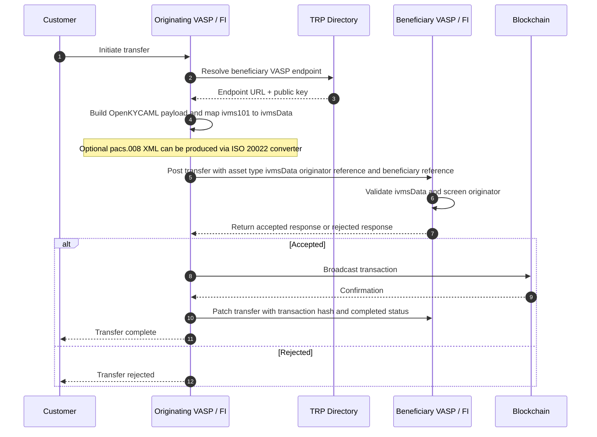
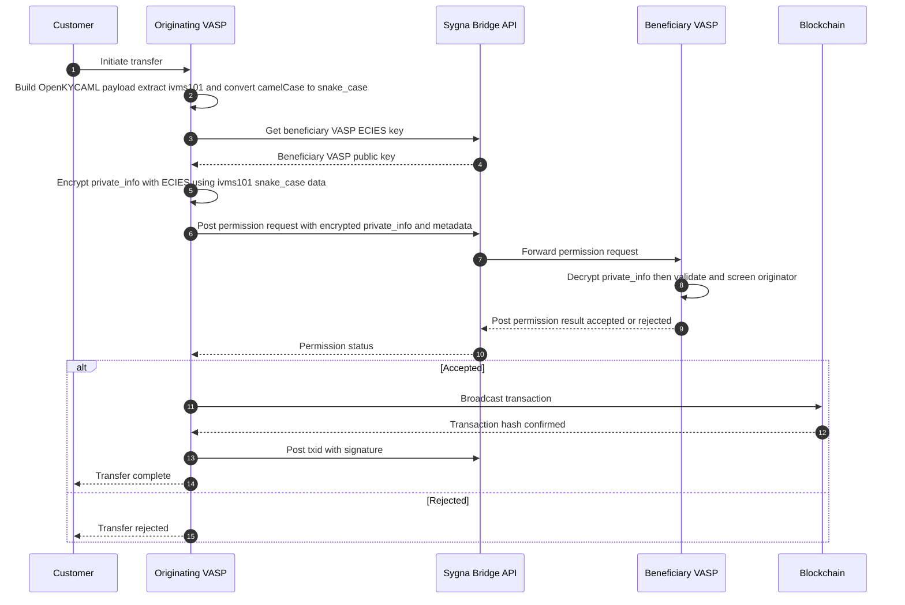
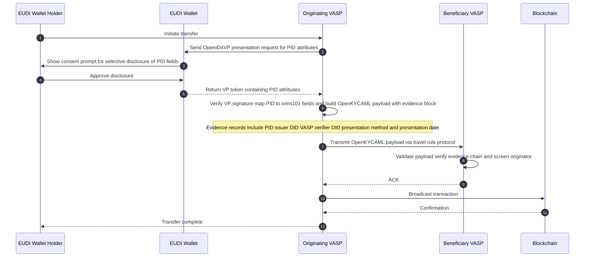

# Travel Rule Message Flow — Sequence Diagrams

This document contains Mermaid sequence diagrams for the five major Travel Rule protocols supported by OpenKYCAML: **TRISA**, **OpenVASP**, **Notabene / DAP**, **TRP (SWIFT)**, and **Sygna Bridge**.

For protocol integration code, see the [Travel Rule Implementation Guide](../guides/travel-rule-implementation-guide.md).

---

## Table of Contents

1. [Generic OpenKYCAML Travel Rule Flow](#1-generic-openkycaml-travel-rule-flow)
2. [TRISA Flow](#2-trisa-flow)
3. [OpenVASP Flow](#3-openvasp-flow)
4. [Notabene / DAP Flow](#4-notabene--dap-flow)
5. [TRP — SWIFT Travel Rule Protocol Flow](#5-trp--swift-travel-rule-protocol-flow)
6. [Sygna Bridge Flow](#6-sygna-bridge-flow)
7. [eIDAS 2.0 EUDI Wallet Enhanced Travel Rule Flow](#7-eidas-20-eudi-wallet-enhanced-travel-rule-flow)

---

## 1. Generic OpenKYCAML Travel Rule Flow

The following diagram shows the protocol-agnostic exchange pattern common to all Travel Rule integrations using OpenKYCAML.

---

## 2. TRISA Flow

TRISA uses mutual TLS (mTLS) and gRPC. VASPs register in the TRISA Global Directory Service (GDS). The OpenKYCAML `ivms101` block maps directly to the TRISA `IdentityPayload` protobuf message.

---

## 3. OpenVASP Flow

OpenVASP is a peer-to-peer JSON protocol using Ethereum-based VASP discovery (VASP Index smart contract) and Whisper/Waku or HTTPS transport.

---

## 4. Notabene / DAP Flow

Notabene provides a managed Travel Rule API. The originating VASP posts the IVMS 101 payload via REST. Beneficiary VASP discovery uses DAP (`@` addressing) or the Notabene directory.

---

## 5. TRP — SWIFT Travel Rule Protocol Flow

TRP is a REST-based protocol aligned with SWIFT. Financial institutions using SWIFT can additionally produce ISO 20022 pacs.008 XML with the OpenKYCAML envelope embedded in `<SplmtryData>`.

---

## 6. Sygna Bridge Flow

Sygna Bridge is a commercial hub operated by CoolBitX. VASP-to-VASP data is ECIES-encrypted and routed via the Sygna Bridge API. Sygna uses `snake_case` IVMS 101 field names (protobuf convention); the OpenKYCAML converter handles the camelCase → snake_case transformation.

---

## 7. eIDAS 2.0 EUDI Wallet Enhanced Travel Rule Flow

When the originator has an EUDI Wallet, a PID Verifiable Credential can be included in the OpenKYCAML payload as the `evidence` block, providing high-assurance identity triangulation.

---

*All diagrams are rendered with [Mermaid](https://mermaid.js.org/). Last updated: v1.12.0.*
