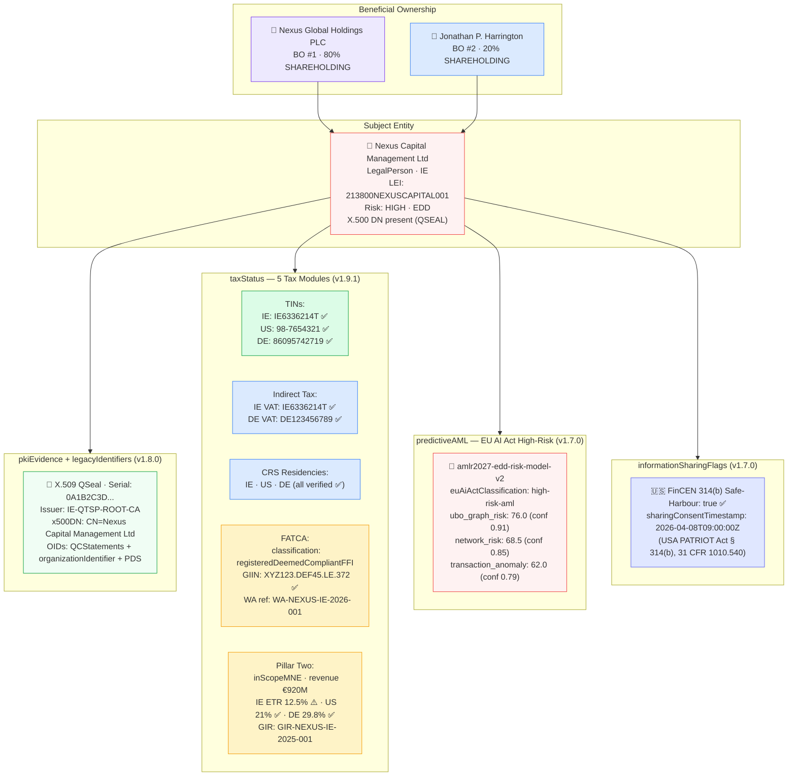

# amlr2027-fatca-ai-act.json — Structure Diagram

**Scenario:** AMLR 2027 + FATCA + EU AI Act — Full-Stack Compliance Record (v1.9.1).  
Nexus Capital Management Ltd (IE) is a comprehensive EDD showcase combining: three-jurisdiction TINs + FATCA GIIN + CRS residencies + Pillar Two (all in `taxStatus`), a QSeal X.509 certificate (`pkiEvidence`), three predictive AML scores from an EU AI Act high-risk model, FinCEN 314(b) safe-harbour flag, and two beneficial owners (Nexus Global Holdings 80% + Jonathan Harrington 20%). This is the widest-coverage example in the repository.

## Feature Matrix — All Extensions Active

| Extension | Fields present | Version added |
|---|---|---|
| Tax / TIN | `taxStatus.tinIdentifiers[]` × 3 | v1.9.0 |
| Indirect tax | `taxStatus.indirectTaxRegistrations[]` × 2 | v1.9.0 |
| FATCA | `taxStatus.fatcaStatus` (GIIN + chapter4) | v1.9.1 |
| CRS | `taxStatus.crsTaxResidencies[]` × 3 | v1.9.1 |
| Pillar Two | `taxStatus.pillarTwo` (ETRs + GIR) | v1.9.0 |
| X.509 PKI | `pkiEvidence` + `legacyIdentifiers` | v1.8.0 |
| Predictive AML | `predictiveAML` (3 scores, EU AI Act) | v1.7.0 |
| FinCEN 314(b) | `informationSharingFlags.section314bSafeHarbor` | v1.7.0 |

## Key Data Points

| Field | Value |
|---|---|
| Schema | OpenKYCAML v1.9.1 |
| Subject | Nexus Capital Management Ltd (IE) |
| Risk | HIGH · EDD |
| UBOs | Nexus Global Holdings PLC (80%) + Jonathan Harrington (20%) |
| FATCA GIIN | `XYZ123.DEF45.LE.372` |
| Pillar Two IE ETR | 12.5% — ⚠️ below GloBE 15% minimum |
| Predictive AML | 3 scores (max: `ubo_graph_risk` 76.0) |
| 314(b) | Safe-harbour active (FinCEN § 314(b)) |
| Regulatory basis | AMLR 2027; FATCA; OECD CRS + Pillar Two; eIDAS 2.0; EU AI Act; USA PATRIOT Act § 314(b) |
