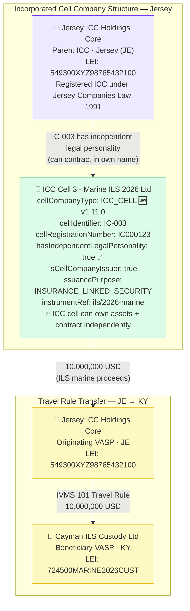

# cell-company/icc-cell.json — Structure Diagram

**Scenario:** Incorporated Cell Company — ICC Cell (IVMS 101).  
ICC Cell 3 - Marine ILS 2026 Ltd (`IC-003`) sends 10,000,000 USD to Cayman ILS Custody Ltd. Unlike a PCC cell, an ICC cell has independent legal personality, allowing it to contract and hold assets in its own name. The parent is Jersey ICC Holdings Core (JE). The cell is an Insurance-Linked Security (ILS) issuer under Jersey law.

## PCC Cell vs ICC Cell Comparison

| Property | PCC Cell (`CELL-007`) | ICC Cell (`IC-003`) |
|---|---|---|
| `cellCompanyType` | `PCC_CELL` | `ICC_CELL` |
| `hasIndependentLegalPersonality` | `false` | `true` |
| Contracts in own name | ❌ — parent PCC contracts | ✅ — cell contracts directly |
| Owns assets | ❌ — parent PCC is legal owner | ✅ — cell is legal owner |
| Governing law | Guernsey (Companies Law 2008) | Jersey (Companies Law 1991) |
| Regulatory significance | Parent PCC is KYC counterparty | ICC cell itself is KYC counterparty |

## Cell Company Fields (v1.11.0+)

| Field | Value |
|---|---|
| `cellCompanyType` | `ICC_CELL` |
| `cellIdentifier` | `IC-003` |
| `cellRegistrationNumber` | `IC000123` |
| `hasIndependentLegalPersonality` | `true` (key ICC distinction) |
| `isCellCompanyIssuer` | `true` |
| `issuancePurpose` | `INSURANCE_LINKED_SECURITY` |

## Key Data Points

| Field | Value |
|---|---|
| Schema | OpenKYCAML v1.11.0 |
| Cell type | ICC_CELL (Incorporated Cell Company) |
| Cell | Jersey ICC Holdings Core · IC-003 |
| Governing law | Jersey Companies Law 1991 |
| KYC risk | HIGH (ILS offshore structure) |
| Asset / Amount | 10,000,000 USD (marine ILS) |
| Originating VASP | Jersey ICC Holdings Core (JE) |
| Beneficiary VASP | Cayman ILS Custody Ltd (KY) |
| Regulatory basis | FATF Rec. 24; AMLR Art. 26; Jersey Financial Services Law 1998 |
