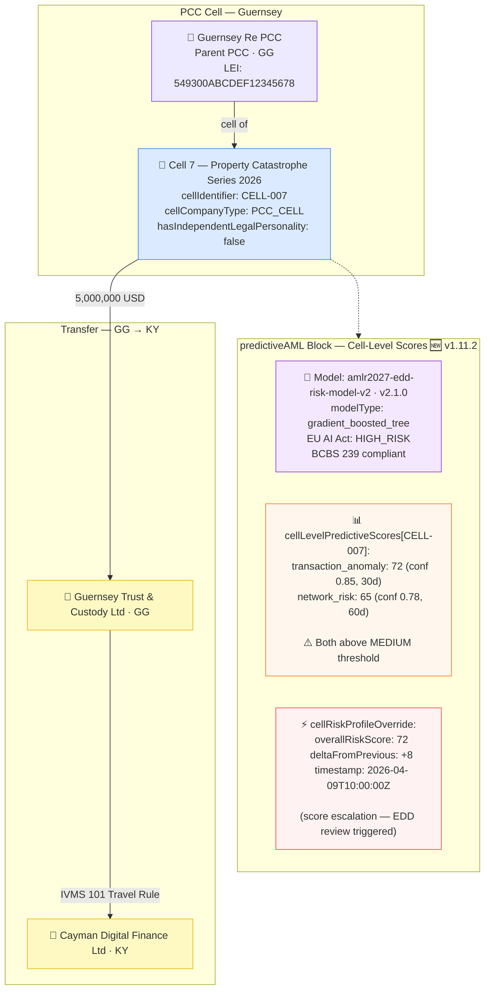
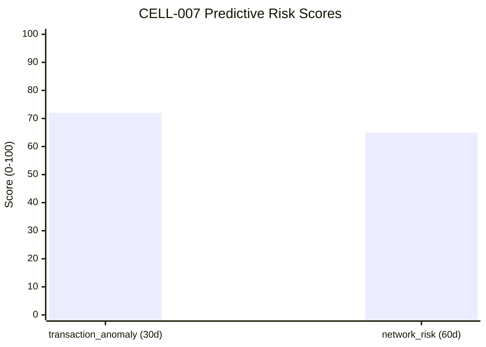

# cell-company/pcc-cell-predictive-aml.json — Structure Diagram

**Scenario:** Protected Cell Company with Cell-Level Predictive AML Scores (v1.11.2).  
Guernsey Re PCC — Cell 7 (`CELL-007`) transfer record is enriched with predictive AML scores at both the entity level and the cell level. The `cellLevelPredictiveScores[]` array (added in v1.11.2) carries cell-specific transaction anomaly and network risk scores. A `cellRiskProfileOverride` reflects an elevated score (72) compared to the previous run (delta +8), indicating a short-window alert for the cell's counterparty network.

## Cell-Level Predictive Score Breakdown

## Cell-Level vs Entity-Level Scores

| Scope | Score type | Value | Confidence | Horizon |
|---|---|---|---|---|
| CELL-007 (cell) | `transaction_anomaly` | 72 | 0.85 | 30 days |
| CELL-007 (cell) | `network_risk` | 65 | 0.78 | 60 days |
| Override | `overallRiskScore` (delta) | 72 (+8 from prev.) | — | — |

## Key Data Points

| Field | Value |
|---|---|
| Schema | OpenKYCAML v1.11.2 |
| Cell | Guernsey Re PCC · Cell 7 (CELL-007) |
| Predictive model | amlr2027-edd-risk-model-v2 v2.1.0 |
| Cell `transaction_anomaly` | 72 / 100 (conf 0.85, 30d) |
| Cell `network_risk` | 65 / 100 (conf 0.78, 60d) |
| `cellRiskProfileOverride` | Score 72, delta +8 (escalation alert) |
| Asset / Amount | 5,000,000 USD |
| Regulatory basis | FATF Rec. 24; EU AI Act Art. 6 (High-Risk AI); BCBS 239; AMLR Art. 26 |
