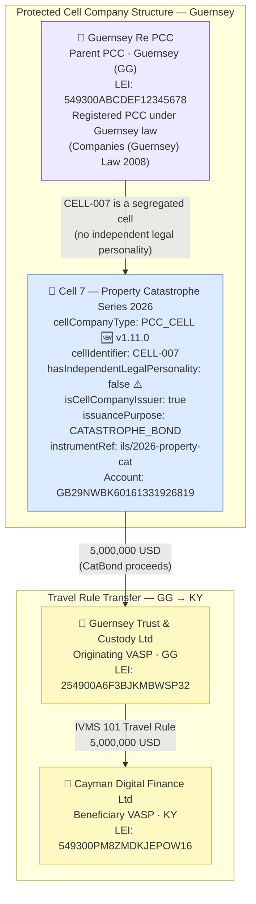

# cell-company/pcc-cell.json — Structure Diagram

**Scenario:** Protected Cell Company — PCC Cell (IVMS 101).  
Guernsey Re PCC — Cell 7 Property Catastrophe Series 2026 (`CELL-007`) sends 5,000,000 USD to Cayman Digital Finance Ltd. The PCC cell has no independent legal personality; the parent PCC (Guernsey Re PCC) is the counterparty of record. The cell is an ILS catastrophe bond issuer, governed by FATF Rec. 24 and the Guernsey Companies (Guernsey) Law 2008.

## Cell Company Fields (v1.11.0+)

| Field | Value | Notes |
|---|---|---|
| `cellCompanyType` | `PCC_CELL` | Segregated cell — no independent legal personality |
| `cellIdentifier` | `CELL-007` | Unique identifier within parent PCC |
| `cellName` | `Cell 7 - Property Catastrophe Series 2026` | Human-readable name |
| `hasIndependentLegalPersonality` | `false` | PCC cell — parent PCC is legal counterparty |
| `isCellCompanyIssuer` | `true` | Cell issues catastrophe bond instruments |
| `issuancePurpose` | `CATASTROPHE_BOND` | ILS product type |
| `parentCellCompanyReference` | Guernsey Re PCC — LEI + GG | Mandatory when `cellCompanyType = PCC_CELL` |

## Key Data Points

| Field | Value |
|---|---|
| Schema | OpenKYCAML v1.11.0 |
| Cell type | PCC_CELL (Protected Cell Company) |
| Cell | Guernsey Re PCC · Cell 7 (CELL-007) |
| Governing law | Guernsey Companies (Guernsey) Law 2008 |
| Asset / Amount | 5,000,000 USD (catastrophe bond) |
| Originating VASP | Guernsey Trust & Custody Ltd (GG) |
| Beneficiary VASP | Cayman Digital Finance Ltd (KY) |
| Regulatory basis | FATF Rec. 24; AMLR Art. 26; Guernsey VASP Rules 2021 |
