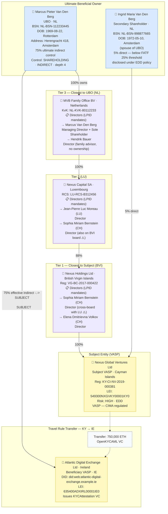
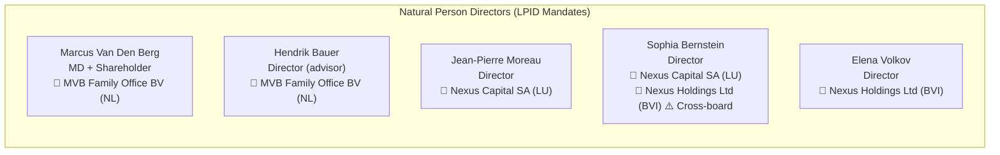

# complex-group-multi-tier.json — Structure Diagram

**Scenario:** Complex Multi-Tier Corporate Group — 4-Layer Holding Structure with Natural Person Directors.  
Nexus Global Ventures Ltd (KY VASP) is controlled by one UBO (Marcus Van Den Berg, NL, 75%) through a four-tier chain. Natural person directors are documented at every tier via LPID mandates. A secondary shareholder (Ingrid Van Den Berg, 5%) is also disclosed under EDD policy.

## Directors at Each Tier

## Key Data Points

| Field | Value |
| --- | --- |
| Schema | OpenKYCAML v1.3.0 |
| Subject VASP | Nexus Global Ventures Ltd (KY) |
| UBO | Marcus Pieter Van Den Berg (NL) — 75%, 4-tier |
| Secondary shareholder | Ingrid Van Den Berg (NL) — 5% direct |
| Holding chain | NL → LU → BVI → KY (4 tiers) |
| Directors documented | 5 natural persons across 3 tiers (LPID mandates) |
| Notable | Sophia Bernstein holds directorships on both LU and BVI boards (cross-appointment flagged as EDD indicator) |
| Beneficiary VASP | Atlantic Digital Exchange Ltd (IE) |
| Asset / Amount | 750,000 ETH |
| Risk | HIGH · EDD |
| Regulatory basis | AMLR Art. 26 — full chain disclosure |
