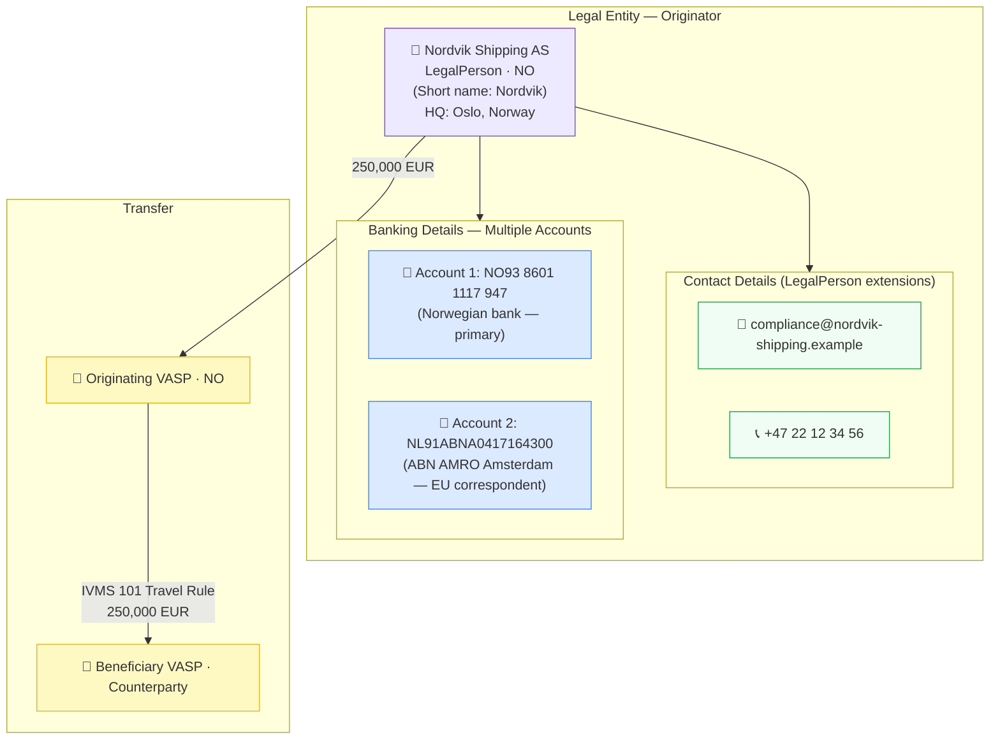

# contact-banking/legal-entity-with-banking.json — Structure Diagram

**Scenario:** Legal Entity with Contact Details and Multiple Bank Accounts.  
Nordvik Shipping AS (NO) sends 250,000 EUR. The record demonstrates multi-account `bankingDetails` on a `LegalPerson` — a Norwegian IBAN and a Dutch account — along with compliance email and switchboard phone, for AMLR Art. 22 / IVMS 101 enriched CDD.

## Contact and Banking Fields

| Field | Path | Value |
|---|---|---|
| Email | `legalPerson.emailAddress` | `compliance@nordvik-shipping.example` |
| Phone | `legalPerson.phoneNumber` | `+4722123456` |
| Account 1 | `legalPerson.bankingDetails[0]` | `NO9386011117947` (primary) |
| Account 2 | `legalPerson.bankingDetails[1]` | `NL91ABNA0417164300` (EU correspondent) |

## Key Data Points

| Field | Value |
|---|---|
| Subject | Nordvik Shipping AS (NO) |
| Contact | Compliance email + main phone |
| Banking | 2 accounts — NO primary + NL EU correspondent |
| Amount | 250,000 EUR |
| Regulatory basis | AMLR Art. 22 CDD; IVMS 101 extended legal-entity profile |
