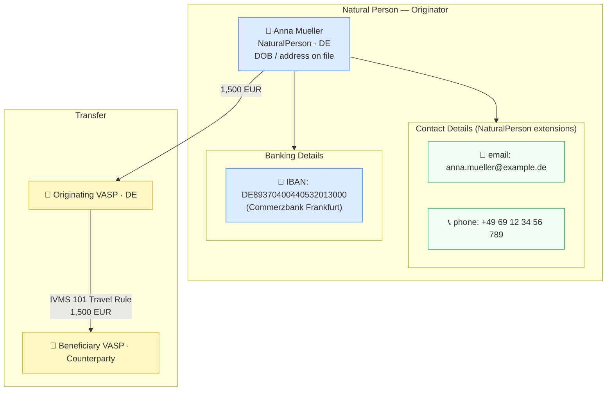

# contact-banking/natural-person-with-contact.json — Structure Diagram

**Scenario:** Natural Person with Contact Details and Banking Information.  
Anna Mueller (DE) sends 1,500 EUR. The record demonstrates the `emailAddress`, `phoneNumber`, and `bankingDetails` extensions on `NaturalPerson` — capturing real-world CDD contact-and-account data for AMLR Art. 22 and IVMS 101 enriched profiles.

## Contact and Banking Fields

| Field | Path | Value |
|---|---|---|
| Email address | `naturalPerson.emailAddress` | `anna.mueller@example.de` |
| Phone number | `naturalPerson.phoneNumber` | `+4969123456789` |
| IBAN | `naturalPerson.bankingDetails[0].iban` | `DE89370400440532013000` |

## Key Data Points

| Field | Value |
|---|---|
| Subject | Anna Mueller (DE) |
| Contact | Email + phone on record |
| Banking | DE IBAN (Commerzbank Frankfurt) |
| Amount | 1,500 EUR |
| Regulatory basis | AMLR Art. 22 CDD data collection; IVMS 101 extended profile |
