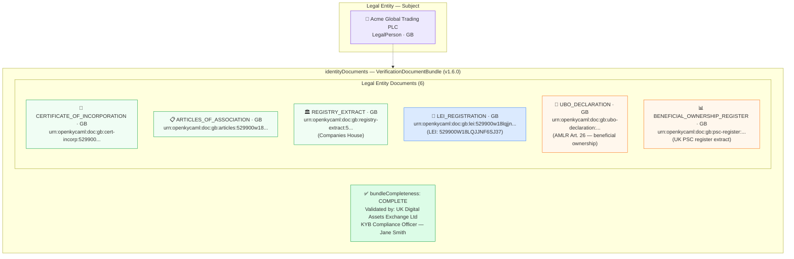

# document-bundle-legal-entity.json — Structure Diagram

**Scenario:** Verification Document Bundle — Legal Entity (v1.6.0).  
Acme Global Trading PLC (GB) has a complete KYB document bundle: certificate of incorporation, articles of association, Companies House registry extract, LEI registration, UBO declaration, and a beneficial ownership register extract (6 documents total). Validated by the VASP's KYB compliance officer. Document IDs use the `urn:openkycaml:doc:` URN convention (v1.6.0+).

## Document Bundle Summary

| # | Document type | Country | Purpose |
|---|---|---|---|
| 1 | `CERTIFICATE_OF_INCORPORATION` | GB | Legal existence proof |
| 2 | `ARTICLES_OF_ASSOCIATION` | GB | Corporate constitution |
| 3 | `REGISTRY_EXTRACT` | GB | Current Companies House filing |
| 4 | `LEI_REGISTRATION` | GB | LEI 529900W18LQJJNF6SJ37 verification |
| 5 | `UBO_DECLARATION` | GB | AMLR Art. 26 self-declaration |
| 6 | `BENEFICIAL_OWNERSHIP_REGISTER` | GB | UK PSC register extract |

## Key Data Points

| Field | Value |
|---|---|
| Schema | OpenKYCAML v1.6.0 |
| Subject | Acme Global Trading PLC (GB) |
| Bundle status | `COMPLETE` |
| Documents | 6 (incorporation + governance + LEI + UBO) |
| Validated by | Jane Smith — KYB Compliance Officer |
| Document ID format | `urn:openkycaml:doc:[country]:[type]:[ref]:[date]` |
| Regulatory basis | AMLR Art. 22/26 CDD + UBO disclosure; UK MLR 2017 |
