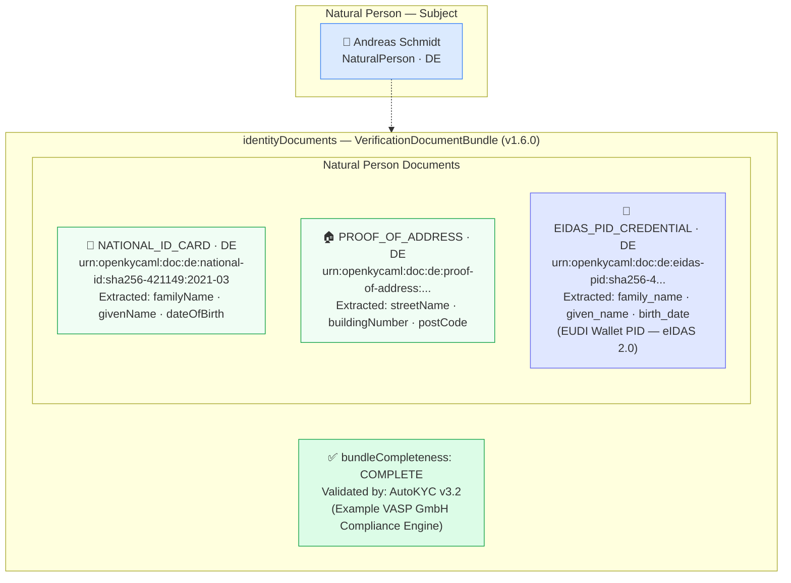

# document-bundle-natural-person.json — Structure Diagram

**Scenario:** Verification Document Bundle — Natural Person (v1.6.0).  
Andreas Schmidt (DE) has a complete CDD document bundle: German national ID, proof of address, and an eIDAS PID credential. The bundle is marked `COMPLETE` and was validated by the VASP's automated KYC engine. Document IDs use the `urn:openkycaml:doc:` URN convention (v1.6.0+).

## Document Bundle Summary

| # | Document type | Country | URN (truncated) | Extracted attributes |
|---|---|---|---|---|
| 1 | `NATIONAL_ID_CARD` | DE | `urn:openkycaml:doc:de:national-id:sha256-421149:2021-03` | familyName, givenName, dateOfBirth |
| 2 | `PROOF_OF_ADDRESS` | DE | `urn:openkycaml:doc:de:proof-of-address:...` | streetName, buildingNumber, postCode |
| 3 | `EIDAS_PID_CREDENTIAL` | DE | `urn:openkycaml:doc:de:eidas-pid:sha256-4...` | family_name, given_name, birth_date |

## Key Data Points

| Field | Value |
|---|---|
| Schema | OpenKYCAML v1.6.0 |
| Subject | Andreas Schmidt (DE) |
| Bundle status | `COMPLETE` |
| Documents | 3 (NID + proof of address + eIDAS PID) |
| Validated by | AutoKYC v3.2 |
| Document ID format | `urn:openkycaml:doc:[country]:[type]:[hash]:[date]` (v1.6.0 convention) |
| Regulatory basis | AMLR Art. 22 CDD; eIDAS 2.0 PID verification |
