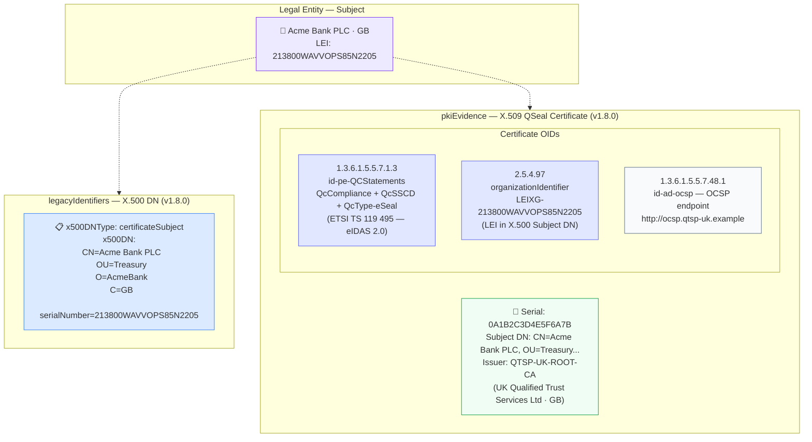

# evidence/eidas-x509-dn.json — Structure Diagram

**Scenario:** X.500 Distinguished Name + X.509 QSeal Certificate — Legal Entity (v1.8.0).  
Acme Bank PLC (GB) is verified via an eIDAS-qualified electronic seal (QSeal) certificate issued by a UK QTSP. The `legacyIdentifiers.x500DN` anchors the X.500 identity, while `pkiEvidence` carries the certificate OIDs including `id-pe-QCStatements`, `organizationIdentifier` (LEI in DN), and OCSP access.

## X.509 OID Summary

| OID | Short name | Value | Standard |
|---|---|---|---|
| `1.3.6.1.5.5.7.1.3` | `id-pe-QCStatements` | QcCompliance + QcSSCD + QcType-eSeal | ETSI TS 119 495 |
| `2.5.4.97` | `organizationIdentifier` | LEIXG-213800WAVVOPS85N2205 | eIDAS 2.0 LPID / LEI-in-DN |
| `1.3.6.1.5.5.7.48.1` | `id-ad-ocsp` | `http://ocsp.qtsp-uk.example` | RFC 5280 |

## Key Data Points

| Field | Value |
|---|---|
| Schema | OpenKYCAML v1.8.0 |
| Subject | Acme Bank PLC (GB) |
| x500DNType | `certificateSubject` |
| Certificate type | X.509 QSeal (eIDAS-qualified electronic seal) |
| Issuer | QTSP-UK-ROOT-CA (UK Qualified Trust Services Ltd) |
| LEI in DN | 213800WAVVOPS85N2205 (via `organizationIdentifier` OID) |
| KYC | CDD |
| Regulatory basis | eIDAS 2.0 Art. 3 (QSEAL); ETSI TS 119 495; X.500/X.509 (RFC 5280); AMLR Art. 22 |
