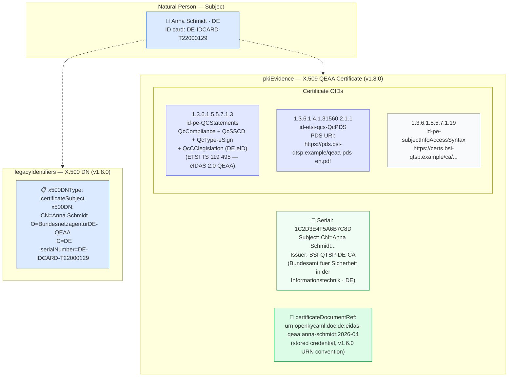

# evidence/eidas-x509-qeaa.json — Structure Diagram

**Scenario:** X.500 DN + X.509 QEAA Certificate — Natural Person (v1.8.0).  
Anna Schmidt (DE) is verified via an eIDAS QEAA (Qualified Electronic Attestation of Attributes) certificate issued by a German BSI-supervised QTSP. The `legacyIdentifiers.x500DN` anchors the personal X.500 identity, while `pkiEvidence` carries `id-pe-QCStatements` (including `QcCClegislation` for German eID), the ETSI PDS URI, and a `certificateDocumentRef` linking to the stored credential.

## X.509 OID Summary

| OID | Short name | Value | Standard |
|---|---|---|---|
| `1.3.6.1.5.5.7.1.3` | `id-pe-QCStatements` | QcCompliance + QcSSCD + QcType-eSign + QcCClegislation | ETSI TS 119 495; eIDAS 2.0 |
| `1.3.6.1.4.1.31560.2.1.1` | `id-etsi-qcs-QcPDS` | PDS URI (policy disclosure statement) | ETSI TS 119 495 §5.1.4 |
| `1.3.6.1.5.5.7.1.19` | `id-pe-subjectInfoAccessSyntax` | Intermediate CA certificate URI | RFC 5280 §4.2.2.2 |

## Key Differences from the Legal-Entity (QSeal) Example

| Property | `eidas-x509-dn.json` (legal entity) | `eidas-x509-qeaa.json` (natural person) |
|---|---|---|
| Certificate type | QSeal (legal person) | QEAA (natural person attestation) |
| `QcType` | `eSeal` | `eSign` |
| Jurisdiction OID | `QcCClegislation` absent | `QcCClegislation` (DE) present |
| `certificateDocumentRef` | Not present | `urn:openkycaml:doc:de:eidas-qeaa:...` |

## Key Data Points

| Field | Value |
|---|---|
| Schema | OpenKYCAML v1.8.0 |
| Subject | Anna Schmidt (DE) |
| x500DNType | `certificateSubject` |
| Certificate type | X.509 QEAA (eIDAS-qualified attribute attestation) |
| Issuer | BSI-QTSP-DE-CA (Bundesamt fuer Sicherheit in der Informationstechnik) |
| `certificateDocumentRef` | `urn:openkycaml:doc:de:eidas-qeaa:anna-schmidt:2026-04` |
| KYC | CDD |
| Regulatory basis | eIDAS 2.0 Art. 45f (QEAA); ETSI TS 119 495; X.509 RFC 5280; AMLR Art. 22 |
