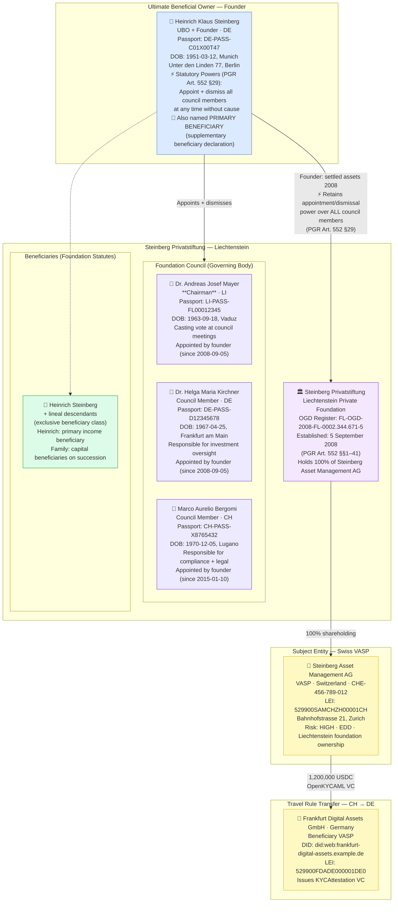
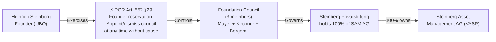

# foundation-complex-ubo.json — Structure Diagram

**Scenario:** Private Foundation Beneficial Ownership — Liechtenstein Privatstiftung.  
Steinberg Asset Management AG (Switzerland VASP) is 100% owned by the Steinberg Privatstiftung (Liechtenstein). The founder, Heinrich Steinberg (DE), retains statutory appointment/dismissal powers over the three-person Foundation Council under PGR Art. 552 §29, conferring DE_FACTO_CONTROL and triggering UBO identification under AMLR Art. 26(2)(c).

## UBO Control Path under PGR Art. 552 §29

## Key Data Points

| Field | Value |
|---|---|
| Schema | OpenKYCAML v1.3.0 |
| Structure | Liechtenstein Privatstiftung (PGR Art. 552) |
| Subject VASP | Steinberg Asset Management AG (CH) |
| UBO | Heinrich Klaus Steinberg (DE) — founder |
| Control mechanism | DE_FACTO_CONTROL via PGR Art. 552 §29 reservation powers |
| Foundation Council | 3 members (Chairman + 2 members) — all natural persons |
| Beneficiaries | Founder + lineal descendants (exclusive class) |
| Asset / Amount | 1,200,000 USDC |
| Beneficiary VASP | Frankfurt Digital Assets GmbH (DE) |
| Risk | HIGH · EDD |
| Regulatory basis | FATF Recommendation 25, AMLR Art. 26(2)(c) |
