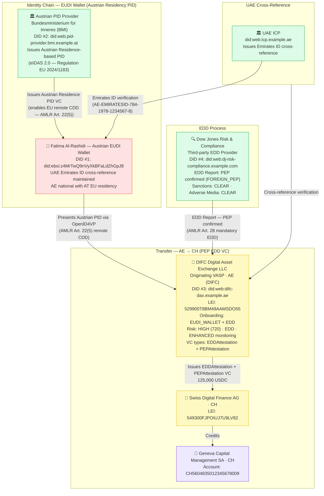
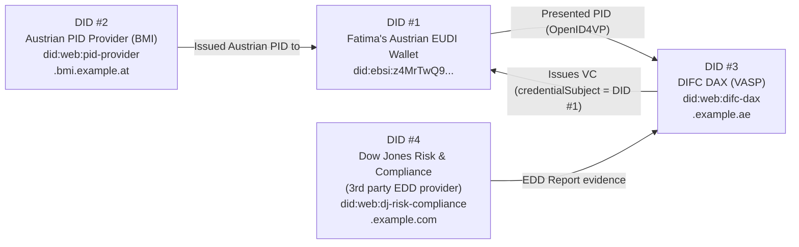

# full-kyc-profile-eudi-wallet.json — Structure Diagram

**Scenario:** EUDI Wallet — Full KYC Profile, EDD, Foreign PEP Case.  
Fatima Noor Al-Rashidi (AE), Former UAE Minister of Finance (2015–2020), is a Foreign PEP onboarding at DIFC Digital Asset Exchange LLC via Austrian EUDI Wallet PID (she has EU residency). **Note: EUDI Wallet PID does NOT reduce PEP risk — EDD is always mandatory per AMLR Art. 28.**

## DID Triangulation (4 DIDs)

## Key Data Points

| Field | Value |
|---|---|
| Schema | OpenKYCAML v1.3.0 |
| Onboarding | EUDI_WALLET (Austrian residency PID) |
| Customer | Fatima Noor Al-Rashidi (AE) — FOREIGN_PEP |
| PEP role | Former UAE Minister of Finance (2015–2020) |
| Risk | HIGH (720) — EUDI Wallet does **not** reduce PEP risk |
| Due diligence | EDD mandatory (AMLR Art. 28) |
| Monitoring | ENHANCED, semi-annual |
| Asset / Amount | 125,000 USDC |
| VC types | EDDAttestation, PEPAttestation |
