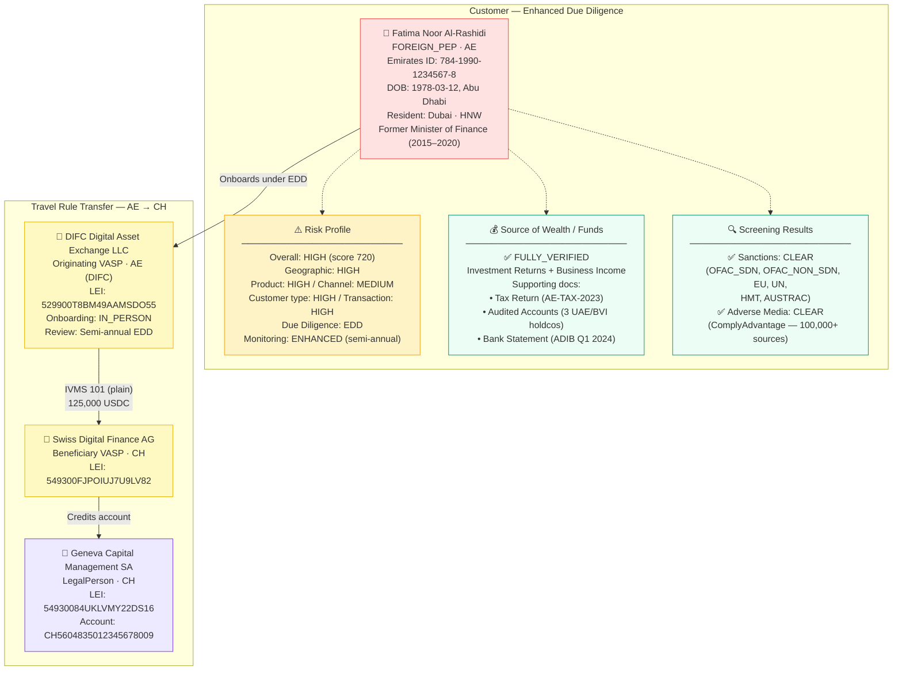
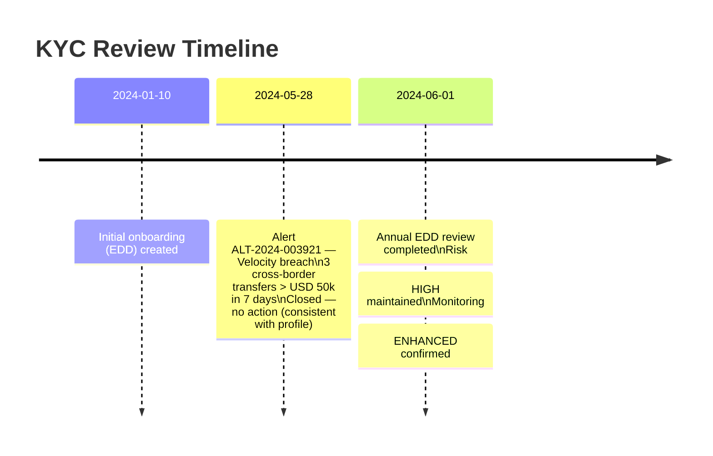

# full-kyc-profile.json — Structure Diagram

**Scenario:** Full KYC Profile — Foreign PEP with EDD (plain JSON, no VC wrapper).  
Fatima Noor Al-Rashidi (AE), Former UAE Minister of Finance (2015–2020), is a Foreign PEP onboarded at DIFC Digital Asset Exchange LLC (AE) under Enhanced Due Diligence. HIGH risk rating (score 720). Sends 125,000 USDC to Geneva Capital Management SA (CH).

## KYC Timeline

## Key Data Points

| Field | Value |
|---|---|
| Schema | OpenKYCAML v1.3.0 |
| Customer | Fatima Noor Al-Rashidi (AE), Foreign PEP |
| PEP role | Former Minister of Finance UAE (2015–2020) |
| Risk rating | HIGH (720/1000) |
| Due diligence | EDD |
| Monitoring | ENHANCED, semi-annual |
| Asset / Amount | 125,000 USDC |
| Originating VASP | DIFC Digital Asset Exchange LLC (AE) |
| Beneficiary | Geneva Capital Management SA (CH) |
