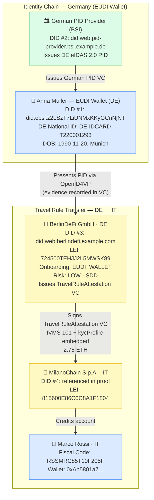
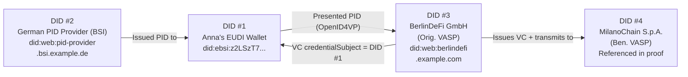

# hybrid-vc-eudi-wallet.json — Structure Diagram

**Scenario:** EUDI Wallet Hybrid VC — Natural Person, full IVMS 101 + kycProfile.  
Anna Müller (DE) sends 2.75 ETH to Marco Rossi (IT) via BerlinDeFi GmbH → MilanoChain S.p.A. Anna is identified via German EUDI Wallet PID. This is the EUDI Wallet companion to hybrid-vc-wrapped.json, adding a 4-DID trust triangle.

## DID Triangulation (4 DIDs)

## Key Data Points

| Field | Value |
|---|---|
| Schema | OpenKYCAML v1.3.0 |
| Onboarding | EUDI_WALLET (German PID, OpenID4VP) |
| VC type | TravelRuleAttestation |
| Originator | Anna Katharina Müller (DE) — EUDI Wallet |
| Beneficiary | Marco Rossi (IT) |
| Asset / Amount | 2.75 ETH |
| Risk | LOW · SDD |
| Originating VASP | BerlinDeFi GmbH (DE) |
| Beneficiary VASP | MilanoChain S.p.A. (IT) |
