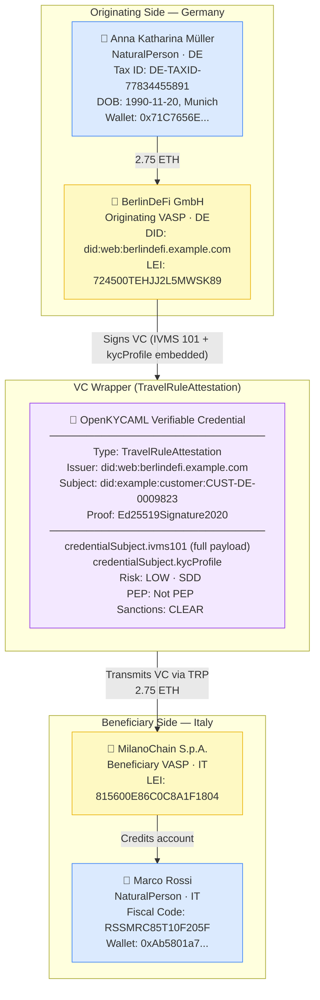

# hybrid-vc-wrapped.json — Structure Diagram

**Scenario:** Hybrid VC-Wrapped — IVMS 101 + KYC Profile + Transaction Monitoring.  
Anna Müller (DE) sends 2.75 ETH to Marco Rossi (IT) via BerlinDeFi GmbH and MilanoChain S.p.A. The full IVMS 101 Travel Rule payload and KYC profile are wrapped in a W3C Verifiable Credential, signed by the originating VASP.

## Key Data Points

| Field | Value |
|---|---|
| Schema | OpenKYCAML v1.3.0 |
| Message type | Hybrid VC-wrapped (IVMS 101 + kycProfile) |
| VC type | TravelRuleAttestation |
| Originator | Anna Katharina Müller (DE) |
| Beneficiary | Marco Rossi (IT) |
| Asset / Amount | 2.75 ETH |
| Risk | LOW · SDD |
| Originating VASP | BerlinDeFi GmbH (DE) |
| Beneficiary VASP | MilanoChain S.p.A. (IT) |
