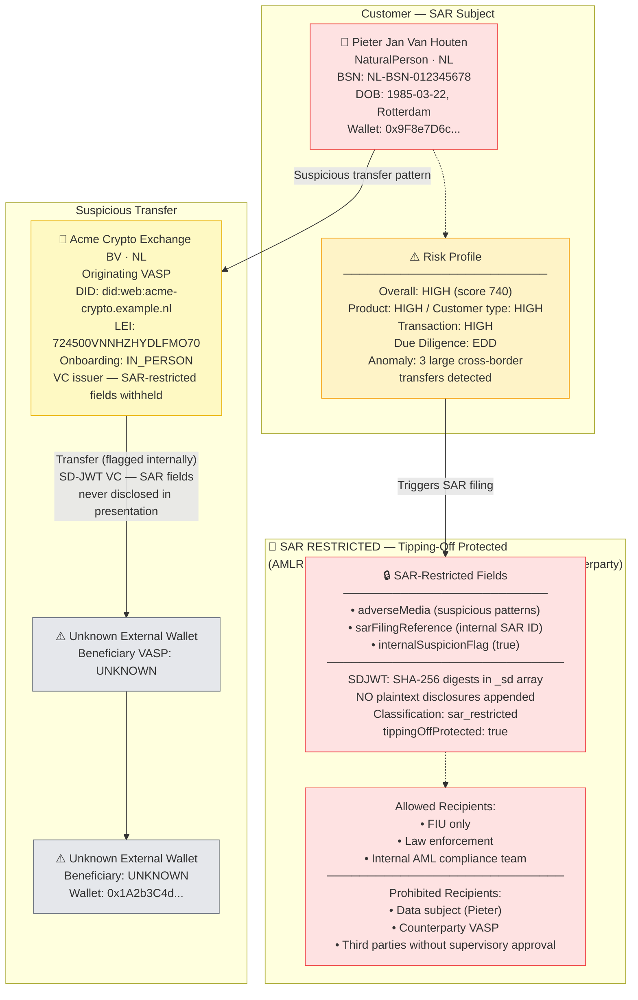
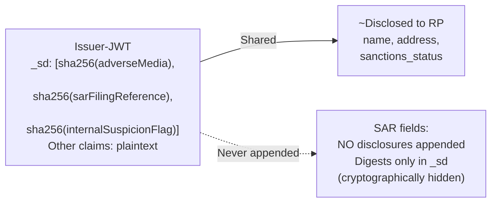

# hybrid-with-sar-restriction.json — Structure Diagram

**Scenario:** SAR Restriction + Tipping-Off Protection.  
Acme Crypto Exchange BV (NL) has filed a Suspicious Activity Report (SAR) on customer Pieter Van Houten after detecting anomalous transaction patterns. SAR-restricted fields are cryptographically withheld via SD-JWT and protected by tipping-off rules (AMLR Art. 73). The data subject and counterparty VASP must never learn of the SAR.

## SD-JWT SAR Protection Mechanism

## Key Data Points

| Field | Value |
|---|---|
| Schema | OpenKYCAML v1.3.0 |
| Subject | Pieter Jan Van Houten (NL) |
| Risk | HIGH (740) · EDD |
| SAR status | FILED — tipping-off protected |
| Legal basis | AMLR Art. 73 (tipping-off prohibition) |
| GDPR classification | `sar_restricted` |
| SD-JWT mechanism | SAR fields: digests only, no disclosures |
| Allowed recipients | FIU, Law Enforcement, Internal AML only |
| VASP | Acme Crypto Exchange BV (NL) |
