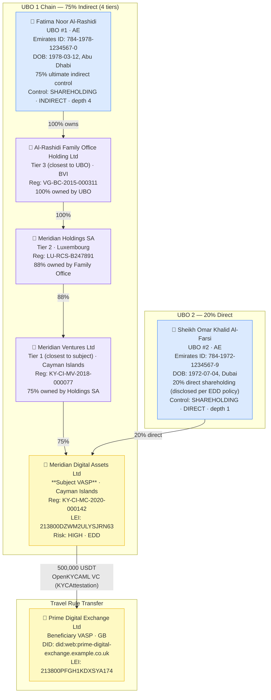

# legal-entity-deep-ubo.json — Structure Diagram

**Scenario:** Enhanced Beneficial Ownership — 4-Tier Corporate Chain (AMLR Art. 26).  
Meridian Digital Assets Ltd (KY) is the subject VASP sending 500,000 USDT to Prime Digital Exchange Ltd (GB). Full AMLR Art. 26 chain disclosure for two UBOs: Fatima Al-Rashidi (75% indirect, 4-tier chain) and Sheikh Omar Al-Farsi (20% direct).

## Ownership Summary

| UBO | Ownership | Depth | Mechanism | Chain |
|---|---|---|---|---|
| Fatima Al-Rashidi (AE) | 75% indirect | 4 | SHAREHOLDING | Family Office BVI → Holdings SA LU → Ventures KY → Subject |
| Sheikh Omar Al-Farsi (AE) | 20% direct | 1 | SHAREHOLDING | Direct |
| Others (not reported) | 5% | — | — | Below FATF 25% threshold |

## Key Data Points

| Field | Value |
|---|---|
| Schema | OpenKYCAML v1.3.0 |
| Subject VASP | Meridian Digital Assets Ltd (KY) |
| Risk | HIGH · EDD (offshore chain, complex UBO) |
| Primary UBO | Fatima Noor Al-Rashidi (AE) — 75%, 4-tier |
| Secondary UBO | Sheikh Omar Al-Farsi (AE) — 20%, direct |
| Beneficiary VASP | Prime Digital Exchange Ltd (GB) |
| Asset / Amount | 500,000 USDT |
| Regulatory basis | AMLR Art. 26 full chain disclosure |
