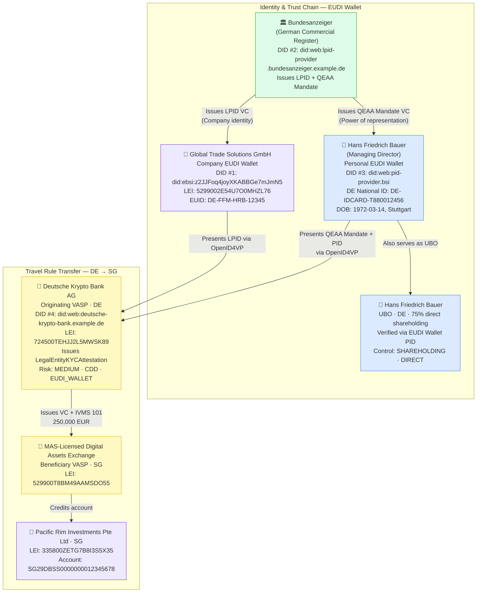
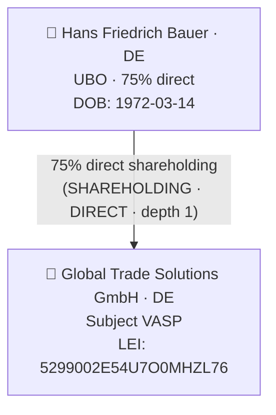

# legal-entity-eudi-wallet.json — Structure Diagram

**Scenario:** EUDI Wallet KYC — Legal Entity with LPID and Director Mandate.  
Global Trade Solutions GmbH (DE) onboards at Deutsche Krypto Bank AG by presenting its eIDAS 2.0 LPID from the German company EUDI Wallet, issued by Bundesanzeiger. Director Hans Bauer presents a QEAA mandate confirming his power of representation. UBO: Hans Friedrich Bauer (75% direct).

## Beneficial Ownership

## Key Data Points

| Field | Value |
|---|---|
| Schema | OpenKYCAML v1.3.0 |
| Onboarding | EUDI_WALLET |
| Originator | Global Trade Solutions GmbH (DE) — LPID + QEAA Mandate |
| UBO | Hans Friedrich Bauer (75% direct) |
| Beneficiary | Pacific Rim Investments Pte Ltd (SG) |
| Asset / Amount | 250,000 EUR |
| Risk | MEDIUM · CDD |
| Evidence | LPID (Bundesanzeiger), QEAA Mandate, Director PID |
| VC type | LegalEntityKYCAttestation |
