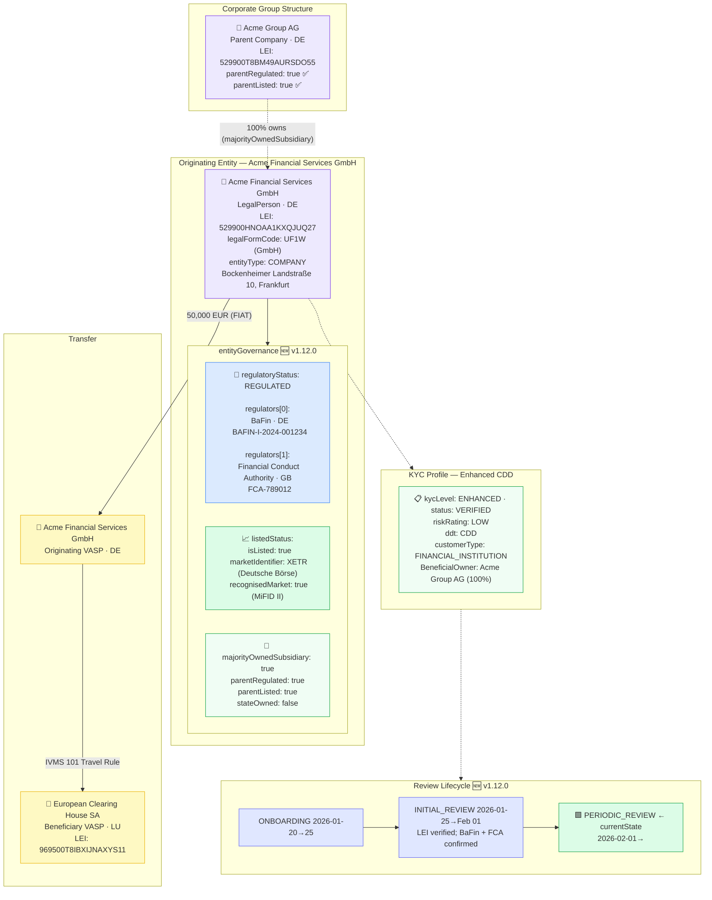

# legal-entity-governance.json — Structure Diagram

**Scenario:** Legal Entity with Full EntityGovernance Block (v1.12.0).  
Acme Financial Services GmbH (DE) is a dual-regulated (BaFin + FCA), exchange-listed subsidiary of Acme Group AG, sending 50,000 EUR to European Clearing House SA (LU). The record showcases the new v1.12.0 `entityGovernance` block with regulators array, listedStatus, parent company linkage, and `reviewLifecycle` state history.

## EntityGovernance Field Summary

| Field | Value | Regulatory basis |
|---|---|---|
| `regulatoryStatus` | `REGULATED` | AMLR Art. 48 CDD reliance |
| `regulators[0]` | BaFin (DE) · BAFIN-I-2024-001234 | AMLR Art. 48; Wolfsberg CBDDQ §3 |
| `regulators[1]` | FCA (GB) · FCA-789012 | Multi-jurisdiction dual-regulation |
| `listedStatus.isListed` | `true` | AMLR Art. 22 SDD eligibility |
| `listedStatus.marketIdentifier` | `XETR` (Deutsche Börse, MiFID II) | MAR insider-dealing risk |
| `listedStatus.recognisedMarket` | `true` | AMLR Art. 22 simplified CDD |
| `majorityOwnedSubsidiary` | `true` | FATF Rec. 24; AMLR Art. 26 |
| `parentRegulated` | `true` | AMLR Art. 48 intra-group reliance |
| `parentListed` | `true` | AMLR Art. 22 SDD; MAR |
| `stateOwned` | `false` | FATF PEP Guidance — no SOE risk |

## Key Data Points

| Field | Value |
|---|---|
| Schema | OpenKYCAML v1.12.0 |
| Message type | KYC_LEGAL_ENTITY |
| Subject | Acme Financial Services GmbH (DE) |
| Regulatory status | REGULATED — dual-licensed (BaFin + FCA) |
| Listed | XETR (Deutsche Börse) — recognised market |
| Parent | Acme Group AG (regulated + listed) |
| Amount | 50,000 EUR |
| KYC level | ENHANCED · CDD |
| Risk | LOW |
| Lifecycle state | PERIODIC_REVIEW |
| Regulatory basis | FATF Rec. 24/25; AMLR Art. 22/26/48; MiFID II; MAR |
