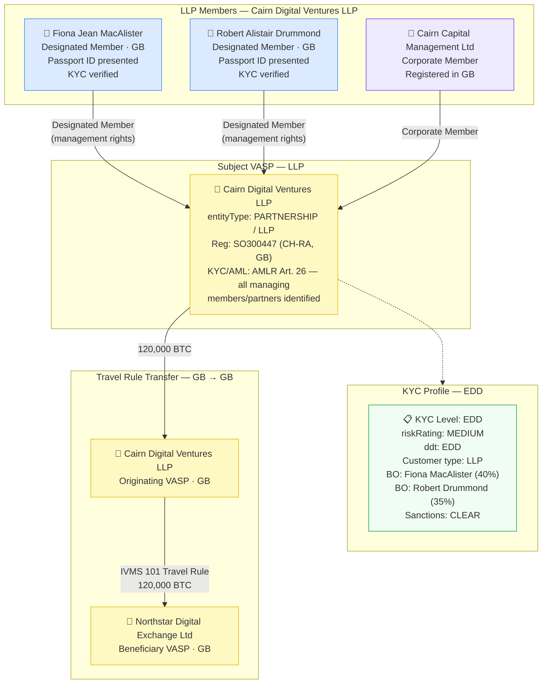

# legal-entity-partnership.json — Structure Diagram

**Scenario:** UK Limited Liability Partnership (LLP) — Cairn Digital Ventures LLP (GB) sends 120,000 BTC to Northstar Digital Exchange Ltd (GB). The record captures the LLP partnership structure with two natural-person members (Designated Members) and one corporate member, under AMLR Art. 26 CDD requirements for partnerships.

## Partnership Structure Summary

| Role | Name | Type | Notes |
|---|---|---|---|
| Designated Member | Fiona Jean MacAlister (GB) | Natural person | 40% ownership — UBO above FATF 25% threshold |
| Designated Member | Robert Alistair Drummond (GB) | Natural person | 35% ownership — UBO above FATF 25% threshold |
| Corporate Member | Cairn Capital Management Ltd (GB) | Legal person | 25% — CDD applied to legal person |

## Key Data Points

| Field | Value |
|---|---|
| Schema | OpenKYCAML v1.4.0 |
| Structure | UK Limited Liability Partnership |
| Entity | Cairn Digital Ventures LLP (GB) |
| Members | 2 natural persons + 1 corporate member |
| Designated members | MacAlister + Drummond (management control) |
| Asset / Amount | 120,000 BTC |
| KYC level | EDD |
| Risk | MEDIUM |
| Beneficiary VASP | Northstar Digital Exchange Ltd (GB) |
| Regulatory basis | FATF Rec. 24; AMLR Art. 26; Companies Act 2006 (LLP Regs 2001) |
