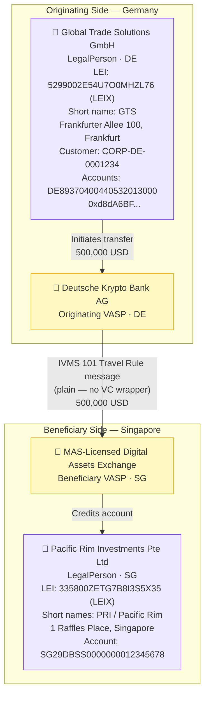

# legal-entity-plain.json — Structure Diagram

**Scenario:** Legal Entity IVMS 101 Travel Rule — Plain (no VC wrapper).  
Global Trade Solutions GmbH (DE) sends 500,000 USD to Pacific Rim Investments Pte Ltd (SG) via two VASPs.

## Key Data Points

| Field | Value |
|---|---|
| Schema | OpenKYCAML v1.3.0 |
| Message type | IVMS 101 plain (no VC wrapper) |
| Originator | Global Trade Solutions GmbH, DE legal entity |
| Beneficiary | Pacific Rim Investments Pte Ltd, SG legal entity |
| Asset / Amount | 500,000 USD |
| Originating VASP | Deutsche Krypto Bank AG (DE) |
| Beneficiary VASP | MAS-Licensed Digital Assets Exchange (SG) |
| ID type | LEI (LEIX) for both entities |
