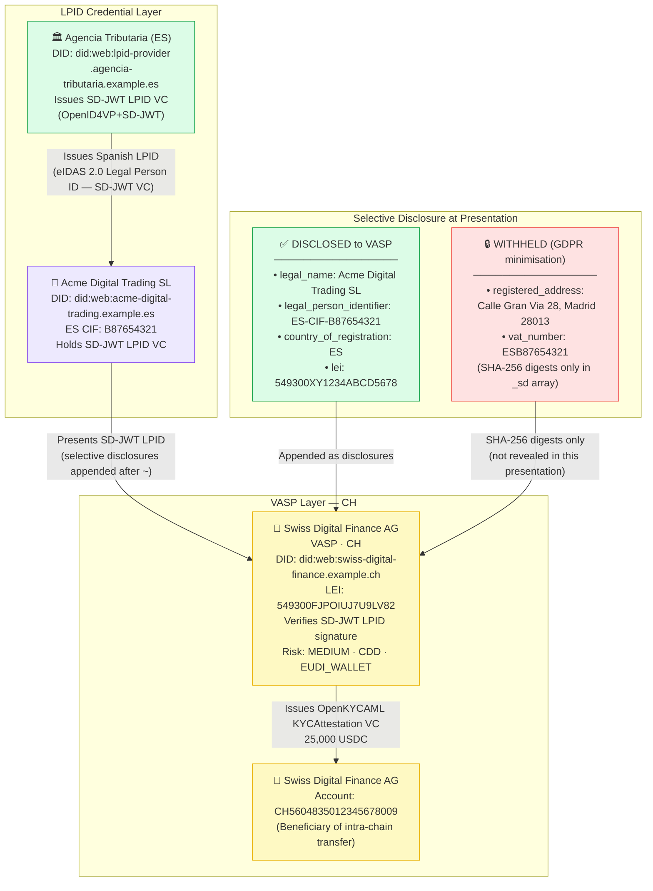
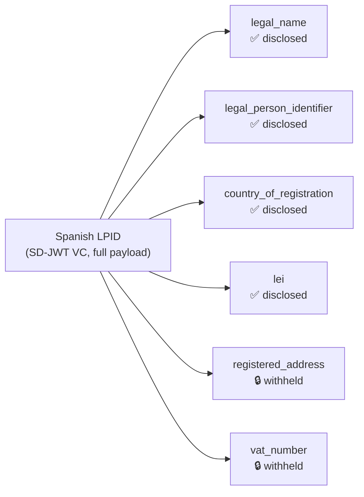

# legal-entity-sd-jwt-eudi-wallet.json — Structure Diagram

**Scenario:** SD-JWT Selective Disclosure — Legal Entity (EUDI Wallet LPID).  
Acme Digital Trading SL (ES) onboards at Swiss Digital Finance AG (CH) by presenting a Spanish LPID credential via SD-JWT VC / OpenID4VP. The entity discloses its legal name, LEI, and country of registration but withholds its VAT number and registered address.

## SD-JWT Disclosure Summary

## Key Data Points

| Field | Value |
|---|---|
| Schema | OpenKYCAML v1.3.0 |
| Format | SD-JWT VC via OpenID4VP+SD-JWT |
| Originator | Acme Digital Trading SL (ES) |
| Beneficiary VASP | Swiss Digital Finance AG (CH) |
| Disclosed claims | legal_name, identifier, country, LEI |
| Withheld claims | registered_address, vat_number |
| Asset / Amount | 25,000 USDC |
| Risk | MEDIUM · CDD |
| Privacy basis | GDPR data-minimisation (Art. 5(1)(c)) |
