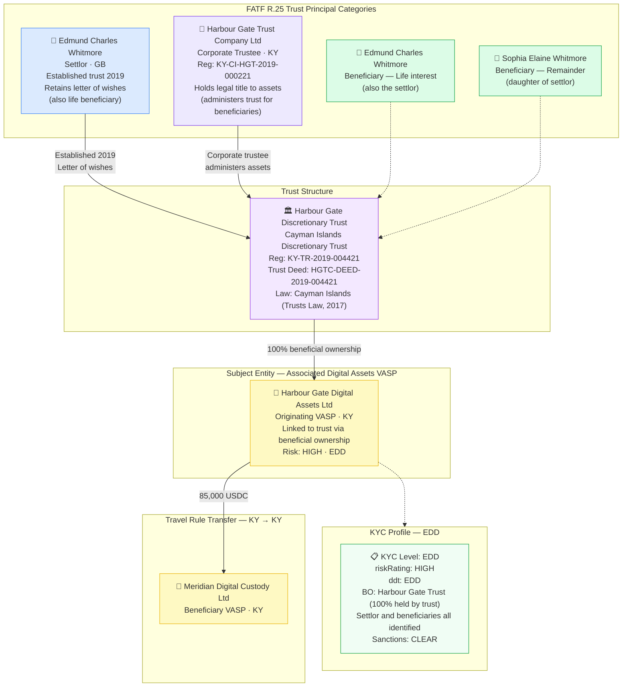

# legal-entity-trust.json — Structure Diagram

**Scenario:** Cayman Islands Discretionary Trust — Harbour Gate Discretionary Trust (KY) sends 85,000 USDC to Meridian Digital Custody Ltd via its associated digital assets VASP. The structure captures the trust principals under FATF Recommendation 25 — settlor, corporate trustee, named beneficiaries — against AMLR Art. 26(2)(b).

## FATF R.25 Trust Principals

| Role | Name | Jurisdiction | Notes |
|---|---|---|---|
| Settlor | Edmund Charles Whitmore | GB | Also life-interest beneficiary; letter of wishes |
| Trustee | Harbour Gate Trust Company Ltd (corporate) | KY | Legal title holder; administers for beneficiaries |
| Beneficiary 1 | Edmund Charles Whitmore | GB | Life interest in income |
| Beneficiary 2 | Sophia Elaine Whitmore | GB | Remainder interest (daughter) |
| Protector | — | — | Not appointed in this trust |

## Key Data Points

| Field | Value |
|---|---|
| Schema | OpenKYCAML v1.4.0 |
| Structure | Cayman Islands Discretionary Trust |
| Trust reference | HGTC-DEED-2019-004421 |
| Governing law | Cayman Islands Trusts Law 2017 |
| Settlor | Edmund Whitmore (GB) |
| Corporate trustee | Harbour Gate Trust Company Ltd |
| Beneficiaries | 2 (settlor life interest + daughter remainder) |
| Asset / Amount | 85,000 USDC |
| KYC level | EDD |
| Risk | HIGH |
| Beneficiary VASP | Meridian Digital Custody Ltd (KY) |
| Regulatory basis | FATF Rec. 25; AMLR Art. 26(2)(b); Cayman Trusts Law 2017 |
