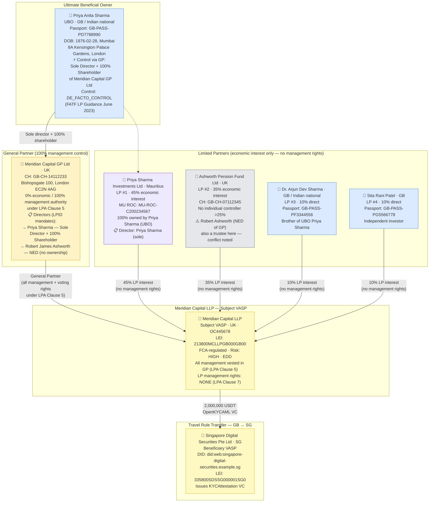
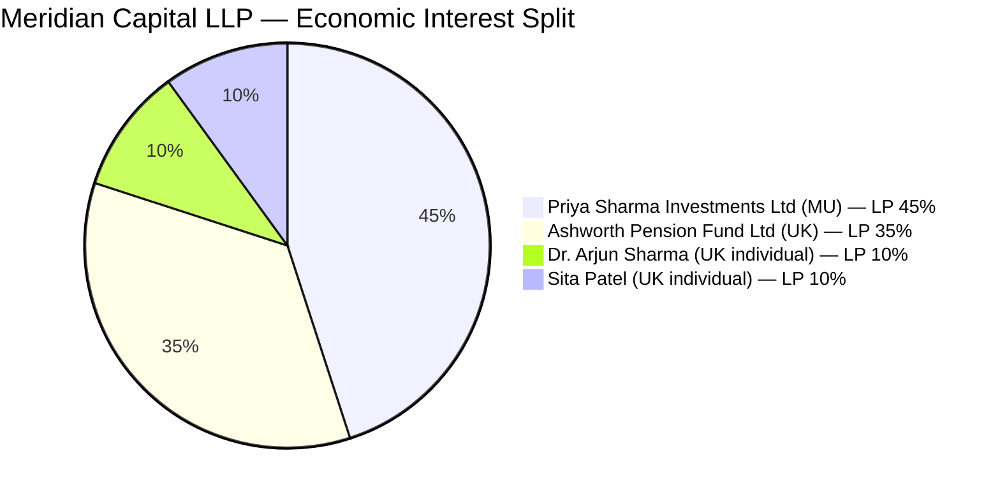
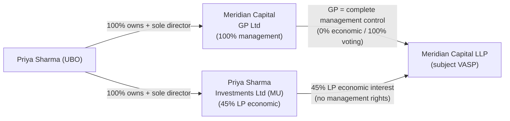

# llp-complex-ubo.json — Structure Diagram

**Scenario:** Limited Liability Partnership — UK LLP with Corporate General Partner and Multiple Limited Partners.  
Meridian Capital LLP (UK) is the subject VASP sending 2,000,000 USDT to Singapore Digital Securities Pte Ltd. Control flows exclusively through the General Partner (Meridian Capital GP Ltd). The UBO is Priya Sharma — sole director and 100% shareholder of the GP. Limited Partners have no management rights under the LPA.

## Partnership Interest Summary

## UBO Determination Logic

## Key Data Points

| Field | Value |
|---|---|
| Schema | OpenKYCAML v1.3.0 |
| Structure | UK LLP with corporate GP and 4 LPs |
| Subject VASP | Meridian Capital LLP (UK, FCA-regulated) |
| UBO | Priya Anita Sharma (GB/IN) — via GP control |
| UBO control basis | Sole director + 100% shareholder of General Partner |
| GP economic interest | 0% (management fee only) |
| LP partners | 2 corporate + 2 individual |
| Notable conflict | Robert Ashworth — NED of GP and trustee of LP #2 pension fund |
| Asset / Amount | 2,000,000 USDT |
| Beneficiary VASP | Singapore Digital Securities Pte Ltd (SG) |
| Risk | HIGH · EDD |
| Regulatory basis | AMLR Art. 26(1), FATF LP Transparency Guidance (June 2023) |
