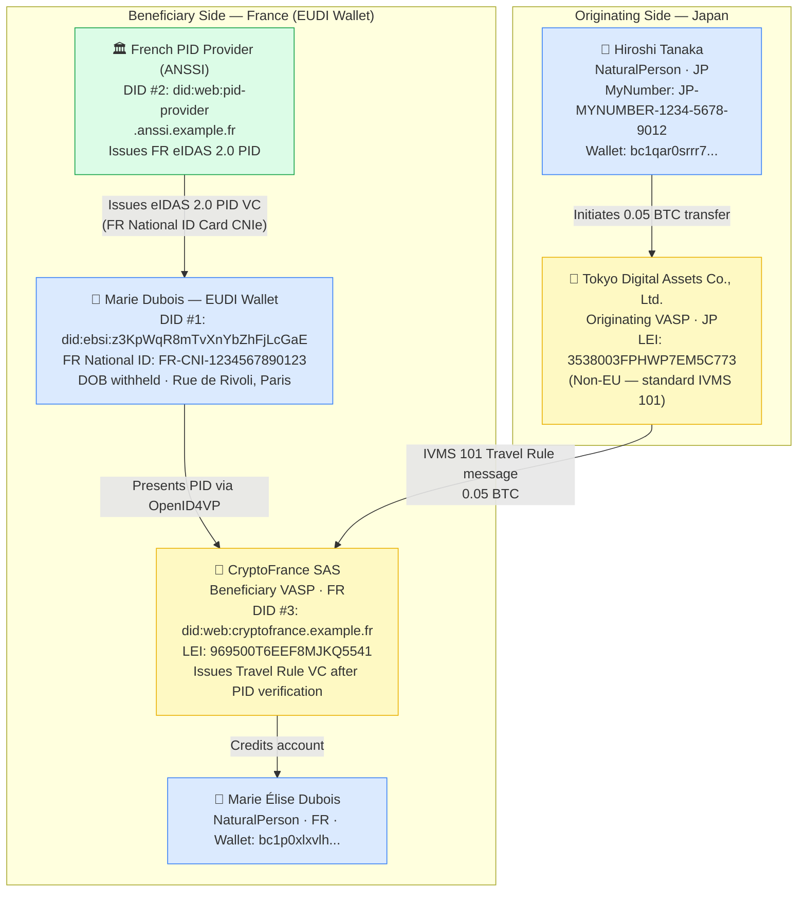
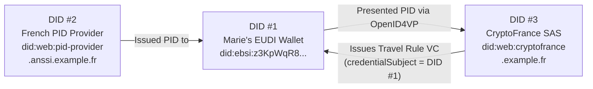

# minimal-travel-rule-eudi-wallet.json — Structure Diagram

**Scenario:** EUDI Wallet Travel Rule — Minimal. Hiroshi Tanaka (JP) sends 0.05 BTC to Marie Dubois (FR). Marie presents her French eIDAS 2.0 PID at the beneficiary VASP via EUDI Wallet. Originator is a non-EU Japanese customer identified by standard IVMS 101.

## DID Triangulation (Beneficiary Side)

## Key Data Points

| Field | Value |
|---|---|
| Schema | OpenKYCAML v1.3.0 |
| Originator | Hiroshi Tanaka (JP) — standard IVMS 101, non-EU |
| Beneficiary | Marie Élise Dubois (FR) — eIDAS 2.0 PID via EUDI Wallet |
| Asset / Amount | 0.05 BTC |
| Originating VASP | Tokyo Digital Assets Co., Ltd. (JP) |
| Beneficiary VASP | CryptoFrance SAS (FR) |
| Beneficiary onboarding | EUDI_WALLET (OpenID4VP) |
| VC type | TravelRuleAttestation |
