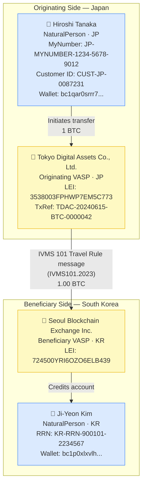

# minimal-travel-rule.json — Structure Diagram

**Scenario:** Minimal IVMS 101 Travel Rule — Natural Person to Natural Person (Japan → South Korea).  
Hiroshi Tanaka (JP) sends 1 BTC to Ji-Yeon Kim (KR). Minimal required fields only; IVMS101.2023 payload metadata included.

## Key Data Points

| Field | Value |
|---|---|
| Schema | OpenKYCAML v1.3.0 |
| Message type | IVMS 101 plain (no VC wrapper) |
| Payload version | IVMS101.2023 |
| Originator | Hiroshi Tanaka, JP natural person |
| Beneficiary | Ji-Yeon Kim, KR natural person |
| Asset / Amount | 1.00 BTC |
| Originating VASP | Tokyo Digital Assets Co., Ltd. (JP) |
| Beneficiary VASP | Seoul Blockchain Exchange Inc. (KR) |
| Transaction ref | TDAC-20240615-BTC-0000042 |
