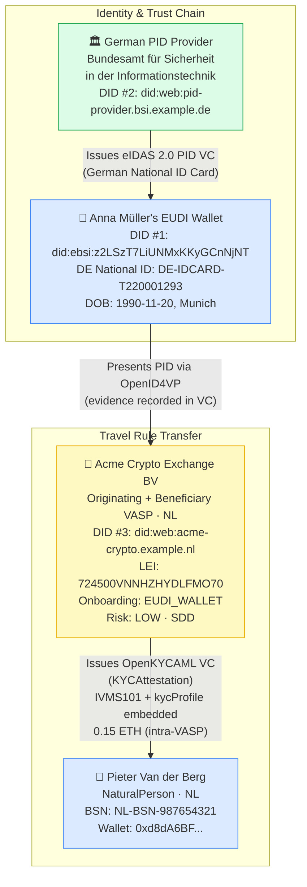
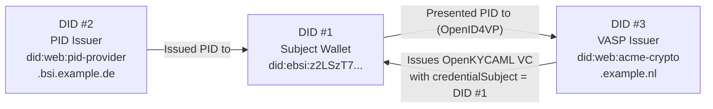

# natural-person-eudi-wallet.json — Structure Diagram

**Scenario:** EUDI Wallet KYC Onboarding — Natural Person.  
Anna Müller (DE) onboards at Acme Crypto Exchange BV (NL) by presenting her German eIDAS 2.0 PID from her EU Digital Identity Wallet via OpenID4VP. Three DIDs triangulate the identity chain.

## DID Triangulation

## Key Data Points

| Field | Value |
|---|---|
| Schema | OpenKYCAML v1.3.0 |
| Onboarding channel | EUDI_WALLET |
| Originator | Anna Katharina Müller (DE), EUDI Wallet |
| Beneficiary | Pieter Van der Berg (NL) |
| Asset / Amount | 0.15 ETH (intra-VASP transfer) |
| Risk rating | LOW · SDD |
| PEP | No |
| Evidence | German National ID Card (eIDAS 2.0 PID, OpenID4VP) |
| VC type | KYCAttestation |
