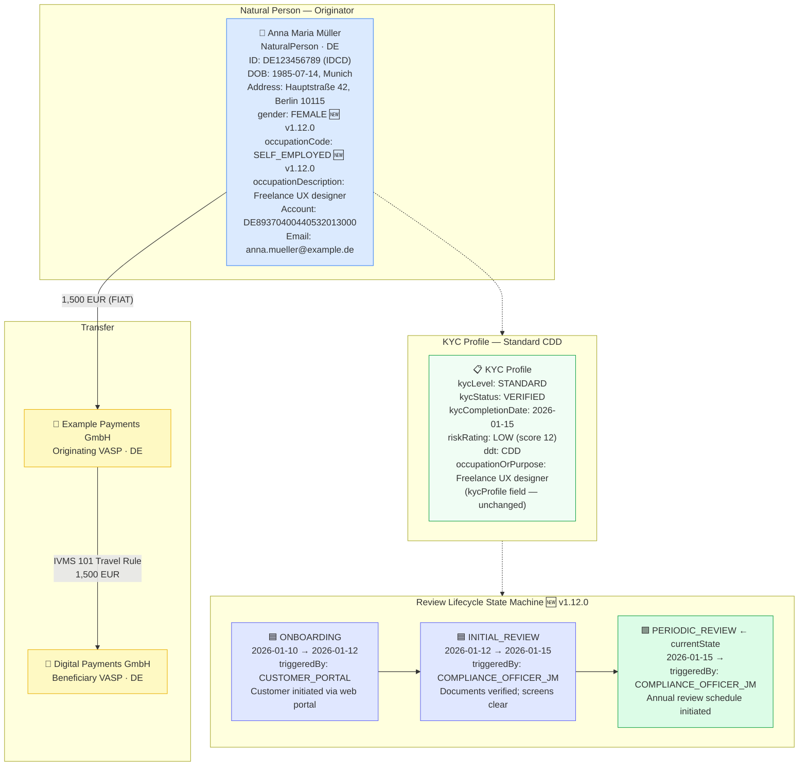

# natural-person-gender-occupation.json — Structure Diagram

**Scenario:** KYC Natural Person with Gender and Structured Occupation (v1.12.0).  
Anna Maria Müller (DE, self-employed UX designer) sends 1,500 EUR to a digital payments provider. The record includes the new v1.12.0 `gender` and structured `occupation` fields, plus a full `reviewLifecycle` state history from ONBOARDING through to PERIODIC_REVIEW (AMLR Art. 21).

## v1.12.0 Fields Highlighted

| Field | Path | Value |
|---|---|---|
| `gender` 🆕 | `naturalPerson.gender` | `FEMALE` (eIDAS 2.0 PID / ISO IEC 5218) |
| `occupationCode` 🆕 | `naturalPerson.occupation.occupationCode` | `SELF_EMPLOYED` (ILO/ISCO-08) |
| `occupationDescription` 🆕 | `naturalPerson.occupation.occupationDescription` | `"Freelance UX designer and digital product consultant"` |
| `reviewLifecycle.currentState` 🆕 | `kycProfile.monitoringInfo.reviewLifecycle.currentState` | `PERIODIC_REVIEW` |
| `stateHistory` 🆕 | `kycProfile.monitoringInfo.reviewLifecycle.stateHistory` | 3 transitions with timestamps and notes |

## Key Data Points

| Field | Value |
|---|---|
| Schema | OpenKYCAML v1.12.0 |
| Message type | KYC_NATURAL_PERSON |
| Subject | Anna Maria Müller (DE) |
| Gender | FEMALE (eIDAS 2.0 PID `gender`) |
| Occupation | SELF_EMPLOYED — Freelance UX designer |
| Amount | 1,500 EUR |
| KYC level | STANDARD · CDD |
| Risk | LOW (score 12) |
| Lifecycle state | PERIODIC_REVIEW (3rd state after ONBOARDING → INITIAL_REVIEW) |
| Regulatory basis | AMLR Art. 22 CDD data; AMLR Art. 21 ongoing monitoring; IVMS 101 extended CDD; eIDAS 2.0 PID |
| GDPR note | `gender` is GDPR Art. 9 special-category data — lawful basis required |
