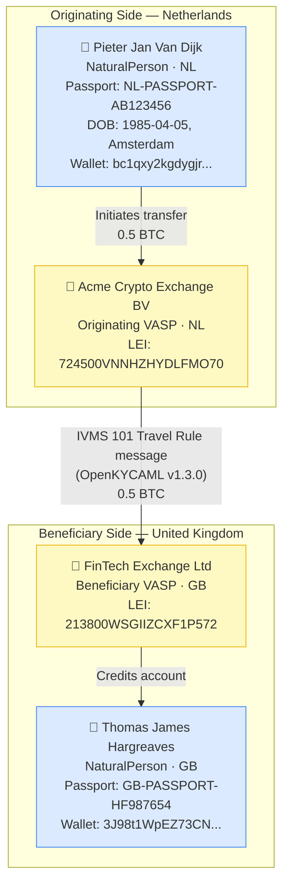

# natural-person-plain.json — Structure Diagram

**Scenario:** Minimal IVMS 101 Travel Rule — Natural Person to Natural Person (plain JSON, no VC wrapper).  
Pieter Jan Van Dijk (NL) sends 0.5 BTC to Thomas James Hargreaves (GB) via two VASPs.

## Key Data Points

| Field | Value |
|---|---|
| Schema | OpenKYCAML v1.3.0 |
| Message type | IVMS 101 (plain — no VC wrapper) |
| Originator | Pieter Jan Van Dijk, NL natural person |
| Beneficiary | Thomas James Hargreaves, GB natural person |
| Asset / Amount | 0.5 BTC |
| Originating VASP | Acme Crypto Exchange BV (NL) |
| Beneficiary VASP | FinTech Exchange Ltd (GB) |
| Due diligence | Standard IVMS 101 — no kycProfile attached |
