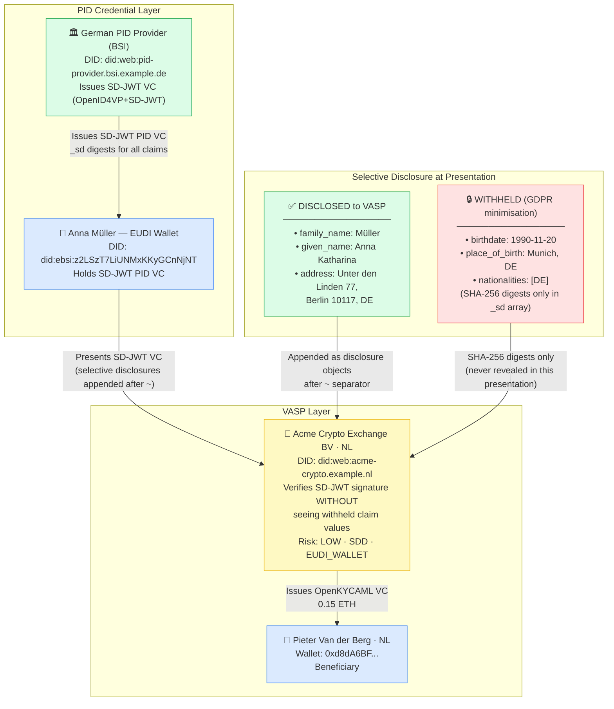
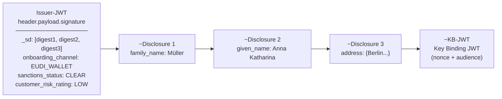

# natural-person-sd-jwt-eudi-wallet.json — Structure Diagram

**Scenario:** SD-JWT Selective Disclosure — Natural Person (EUDI Wallet).  
Anna Müller (DE) presents a German eIDAS 2.0 PID via SD-JWT VC in OpenID4VP. She discloses only her legal name and residential address (FATF Travel Rule minimum) and withholds date of birth, place of birth, and nationality under GDPR data-minimisation.

## SD-JWT Token Structure

## Key Data Points

| Field | Value |
|---|---|
| Schema | OpenKYCAML v1.3.0 |
| Format | SD-JWT VC (dc+sd-jwt) via OpenID4VP+SD-JWT |
| Disclosed claims | family_name, given_name, address |
| Withheld claims | birthdate, place_of_birth, nationalities |
| Privacy basis | GDPR data-minimisation (Art. 5(1)(c)) |
| Asset / Amount | 0.15 ETH (intra-VASP) |
| Risk | LOW · SDD |
