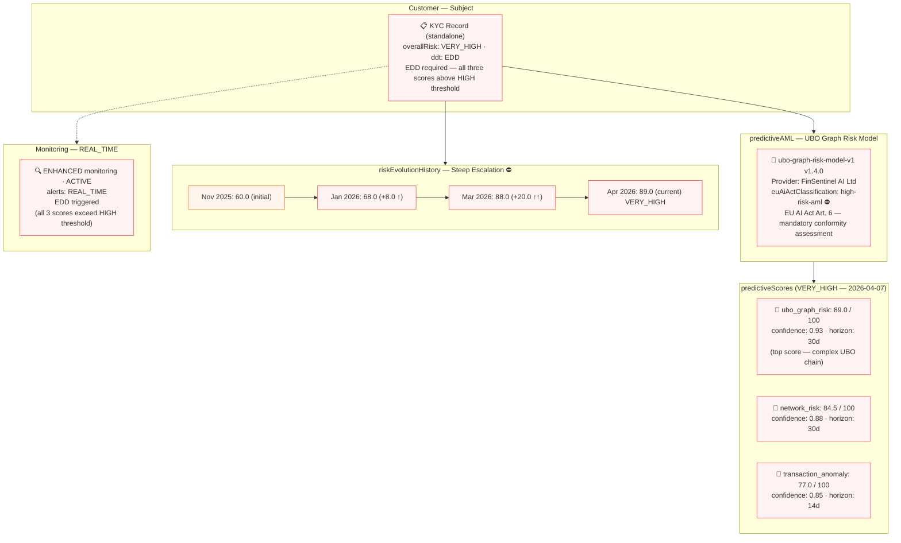

# predictive/predictive-ai-high-risk.json — Structure Diagram

**Scenario:** EU AI Act High-Risk — UBO Graph Predictive AML Model (v1.7.0).  
A KYC record carries three predictive scores from `ubo-graph-risk-model-v1` (EU AI Act `high-risk-aml` classification): `ubo_graph_risk` (89.0), `network_risk` (84.5), and `transaction_anomaly` (77.0). The risk evolution history shows a steep escalation from 60 (Nov 2025) to 88 (Mar 2026). Customer is rated VERY_HIGH with full EDD and REAL_TIME monitoring. The conformity assessment record is required under EU AI Act Art. 6.

## Score Summary (All VERY_HIGH)

| Score type | Value | Confidence | Horizon | Risk level |
|---|---|---|---|---|
| `ubo_graph_risk` | 89.0 / 100 | 0.93 | 30 days | 🔴 VERY_HIGH |
| `network_risk` | 84.5 / 100 | 0.88 | 30 days | 🔴 VERY_HIGH |
| `transaction_anomaly` | 77.0 / 100 | 0.85 | 14 days | 🔴 HIGH |

## Risk Escalation Timeline

| Date | Score | Delta | Trigger |
|---|---|---|---|
| Nov 2025 | 60.0 | baseline | Initial |
| Jan 2026 | 68.0 | +8.0 | UBO graph complexity increased |
| Mar 2026 | 88.0 | +20.0 ↑↑ | Rapid escalation — EDD triggered |
| Apr 2026 | 89.0 (current) | +1.0 | VERY_HIGH sustained |

## Key Data Points

| Field | Value |
|---|---|
| Schema | OpenKYCAML v1.7.0 |
| Predictive model | ubo-graph-risk-model-v1 v1.4.0 |
| Provider | FinSentinel AI Ltd |
| EU AI Act | `high-risk-aml` — conformity assessment required (Art. 6) |
| Overall risk | VERY_HIGH |
| Risk escalation | +29 points over 5 months |
| Monitoring | ENHANCED · REAL_TIME |
| Action | EDD initiated — all scores > HIGH threshold |
| Regulatory basis | EU AI Act Art. 6/9/13; AMLR Art. 21; FATF Rec. 10/11; BCBS 239 |
