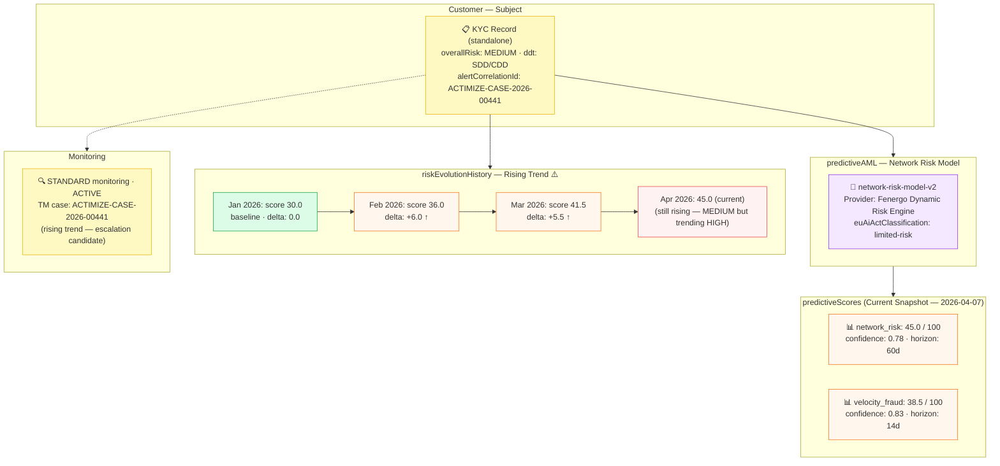

# predictive/predictive-delta.json — Structure Diagram

**Scenario:** Predictive AML Score with Risk Evolution History (Delta Monitoring) (v1.7.0).  
A KYC record carries a `network-risk-model-v2` score snapshot from the Fenergo Dynamic Risk Engine. Two scores are returned: `network_risk` (45.0) and `velocity_fraud` (38.5). Crucially, `riskEvolutionHistory[]` captures 3 monthly snapshots showing a steadily rising score (30 → 36 → 41.5) over Jan–Mar 2026. The record is correlated with TM case `ACTIMIZE-CASE-2026-00441`. Customer is currently rated MEDIUM, under STANDARD monitoring.

## Risk Evolution Trend

| Month | Score | Delta | Signal |
|---|---|---|---|
| Jan 2026 | 30.0 | 0.0 | Baseline |
| Feb 2026 | 36.0 | +6.0 ↑ | Rising |
| Mar 2026 | 41.5 | +5.5 ↑ | Rising |
| Apr 2026 | 45.0 (current) | +3.5 ↑ | ⚠️ Escalation candidate |

## Key Data Points

| Field | Value |
|---|---|
| Schema | OpenKYCAML v1.7.0 |
| Predictive model | network-risk-model-v2 (delta monitoring) |
| Provider | Fenergo Dynamic Risk Engine |
| Current scores | network_risk: 45.0 · velocity_fraud: 38.5 |
| Risk evolution | 4-month rising trend (30 → 45, +15 points) |
| Alert correlation | `ACTIMIZE-CASE-2026-00441` |
| Overall risk | MEDIUM (trending towards HIGH) |
| Monitoring | STANDARD · ACTIVE |
| Regulatory basis | AMLR Art. 21 ongoing monitoring; FATF Rec. 10/11; BCBS 239 |
