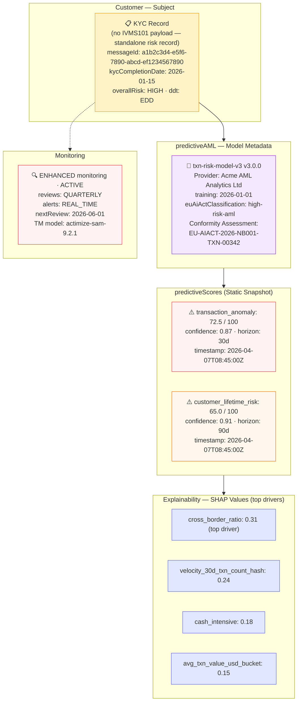

# predictive/predictive-static.json — Structure Diagram

**Scenario:** Static Predictive AML Score Snapshot (v1.7.0).  
A KYC record carries a static predictive risk snapshot from the `txn-risk-model-v3` (EU AI Act high-risk classification, Conformity Assessment EU-AIACT-2026-NB001-TXN-00342). Two scores are present: `transaction_anomaly` (72.5/100, conf 0.87, 30d horizon) and `customer_lifetime_risk` (65.0/100, conf 0.91, 90d horizon). SHAP explainability values identify `cross_border_ratio` and `velocity_30d` as the top drivers. Customer is rated HIGH risk, under ENHANCED monitoring.

## Score Details

| Score type | Value | Confidence | Horizon | Status |
|---|---|---|---|---|
| `transaction_anomaly` | 72.5 / 100 | 0.87 | 30 days | ⚠️ ELEVATED |
| `customer_lifetime_risk` | 65.0 / 100 | 0.91 | 90 days | ⚠️ ELEVATED |

## SHAP Feature Contributions

| Feature | SHAP value | Interpretation |
|---|---|---|
| `cross_border_ratio` | 0.31 | High cross-border transaction rate |
| `velocity_30d_txn_count_hash` | 0.24 | Elevated 30-day transaction velocity |
| `cash_intensive` | 0.18 | Cash-intensive business flag |
| `avg_txn_value_usd_bucket` | 0.15 | High average transaction value bucket |

## Key Data Points

| Field | Value |
|---|---|
| Schema | OpenKYCAML v1.7.0 |
| Predictive model | txn-risk-model-v3 v3.0.0 (static snapshot) |
| EU AI Act | `high-risk-aml` — Conformity Assessment EU-AIACT-2026-NB001-TXN-00342 |
| Overall risk | HIGH |
| Monitoring | ENHANCED · REAL_TIME alerts |
| BCBS 239 | Compliant (data aggregation metadata present) |
| Regulatory basis | EU AI Act Art. 6 (high-risk); AMLR Art. 21 monitoring; BCBS 239 |
