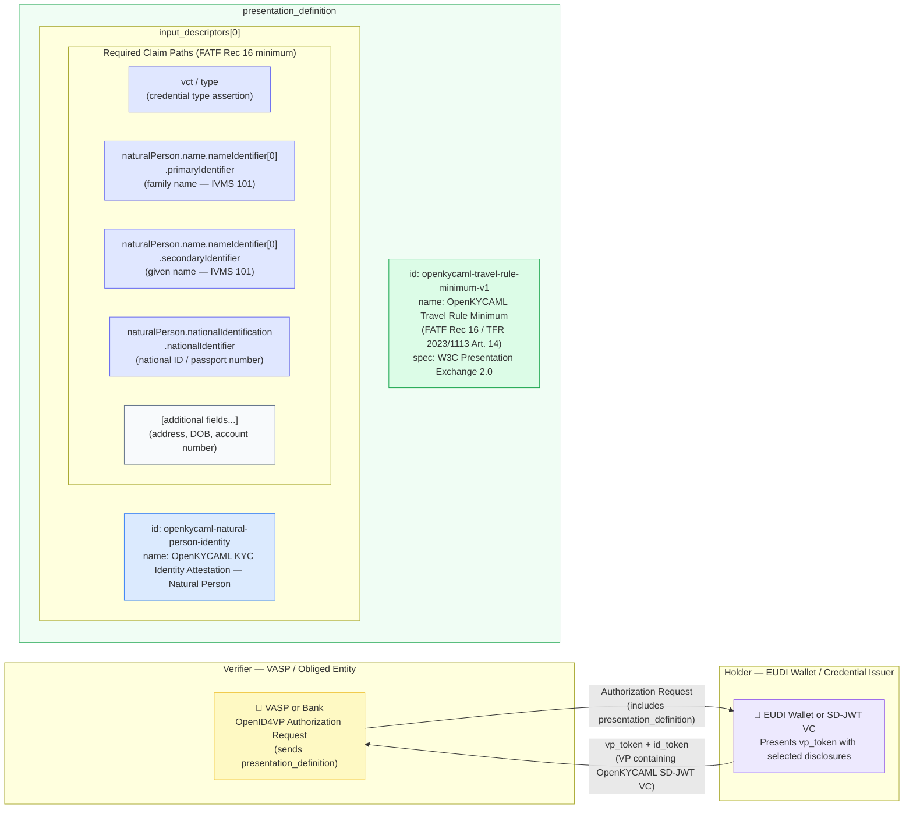

# presentation-definitions/travel-rule-minimum.json — Structure Diagram

**Scenario:** OpenID4VP Presentation Definition — FATF Rec 16 / TFR 2023/1113 Travel Rule Minimum.  
This is a W3C Presentation Exchange 2.0 `presentation_definition` object (not a schema payload). It describes the minimum claims a VASP must request via OpenID4VP Authorization Request to verify the Travel Rule minimum identity data for a natural person originator or beneficiary — aligned with FATF Recommendation 16 and EU TFR Art. 14.

## Required Claim Paths (FATF Rec 16 Minimum)

| # | Claim | IVMS 101 mapping | FATF Rec 16 basis |
|---|---|---|---|
| 1 | `vct` / `type` | Credential type assertion | — |
| 2 | `naturalPerson.name.primaryIdentifier` | Family name | Mandatory originator name |
| 3 | `naturalPerson.name.secondaryIdentifier` | Given name | Mandatory originator name |
| 4 | `naturalPerson.nationalIdentification.nationalIdentifier` | National ID / passport | Mandatory originator ID |
| 5+ | Address, DOB, account number | Additional IVMS 101 fields | TFR Art. 14 extended |

## Key Data Points

| Field | Value |
|---|---|
| File type | W3C Presentation Exchange 2.0 `presentation_definition` (not an OpenKYCAML schema payload) |
| PD ID | `openkycaml-travel-rule-minimum-v1` |
| Protocol | OpenID4VP (OpenID for Verifiable Presentations) |
| Credential format | SD-JWT VC (OpenKYCAML SD-JWT) |
| Minimum claims | 5 field groups covering FATF Rec 16 natural person identity |
| Spec version | `1.3.0` |
| Regulatory basis | FATF Rec. 16; EU TFR 2023/1113 Art. 14; W3C PE 2.0; OpenID4VP |
