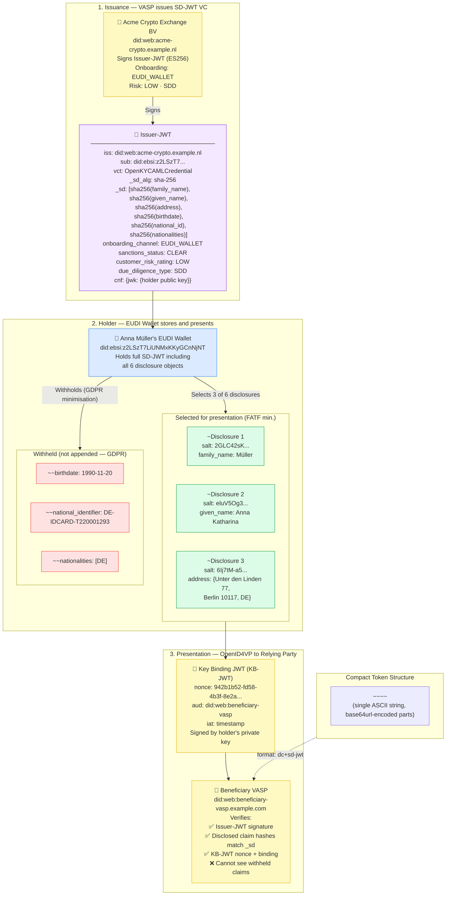

# sd-jwt-compact-token.json — Structure Diagram

**Scenario:** SD-JWT Compact Token — Annotated Reference Example.  
This file documents the complete structure of an OpenKYCAML SD-JWT VC in its compact serialisation as it travels between an issuer, an EUDI Wallet, and a relying party. Anna Müller selectively discloses only the FATF Travel Rule minimum (name + address) and withholds date of birth, national identifier, and nationality.

## Key Data Points

| Field | Value |
|---|---|
| Schema | OpenKYCAML v1.3.0 |
| Format | `dc+sd-jwt` compact token |
| Subject | Anna Katharina Müller (DE) |
| Issuer | Acme Crypto Exchange BV (did:web:acme-crypto.example.nl) |
| Disclosed at presentation | family_name, given_name, address |
| Withheld | birthdate, national_identifier, nationalities |
| Key Binding | KB-JWT (holder-bound, nonce-protected) |
| SD alg | sha-256 |
| Risk | LOW · SDD |
| **Important** | Signature values in this example are PLACEHOLDER stubs — not cryptographically valid |
