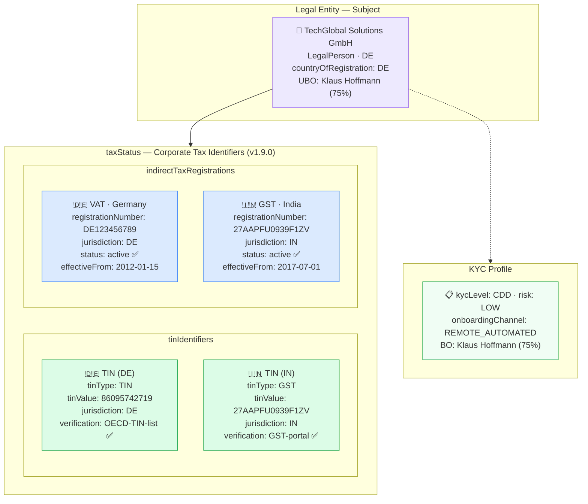

# tax/tax-corporate-vat-gst.json — Structure Diagram

**Scenario:** Corporate Entity — Multi-Jurisdiction VAT + GST Registrations (v1.9.0).  
TechGlobal Solutions GmbH (DE) holds a German TIN, a German VAT registration (DE123456789), and an Indian GST registration (27AAPFU0939F1ZV). The `taxStatus` block captures both `tinIdentifiers[]` and `indirectTaxRegistrations[]` — supporting OECD BEPS and AMLR Art. 22 corporate tax-compliance checks. UBO: Klaus Hoffmann (75%, DE).

## Tax Registration Summary

| Type | Jurisdiction | Registration | Value | Status |
|---|---|---|---|---|
| `TIN` | DE | `tinIdentifiers[0]` | `86095742719` | verified ✅ |
| `GST` | IN | `tinIdentifiers[1]` | `27AAPFU0939F1ZV` | verified ✅ |
| `VAT` | DE | `indirectTaxRegistrations[0]` | `DE123456789` | active ✅ |
| `GST` | IN | `indirectTaxRegistrations[1]` | `27AAPFU0939F1ZV` | active ✅ |

## Key Data Points

| Field | Value |
|---|---|
| Schema | OpenKYCAML v1.9.0 |
| Subject | TechGlobal Solutions GmbH (DE) |
| UBO | Klaus Hoffmann (75%, DE) |
| TINs | 2 (DE + IN) |
| Indirect tax | DE VAT (2012) + IN GST (2017) |
| Risk | LOW |
| Regulatory basis | EU VAT Directive 2006/112/EC; Indian GST Act 2017; OECD BEPS; AMLR Art. 22 |
