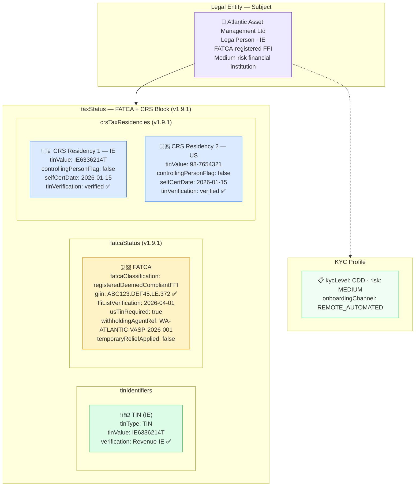

# tax/tax-fatca-crs.json — Structure Diagram

**Scenario:** Financial Institution — FATCA GIIN + Dual-Jurisdiction CRS Tax Residencies (v1.9.1).  
Atlantic Asset Management Ltd (IE) is a FATCA `registeredDeemedCompliantFFI` with GIIN `ABC123.DEF45.LE.372`. It has two CRS tax residencies (IE + US) and carries a withholding-agent reference. The `taxStatus` block demonstrates `fatcaStatus`, `crsTaxResidencies[]`, and `tinIdentifiers[]` — the complete FATCA/CRS data model added in v1.9.1.

## FATCA / CRS Data Summary

| Block | Field | Value |
|---|---|---|
| `fatcaStatus` | `fatcaClassification` | `registeredDeemedCompliantFFI` |
| `fatcaStatus` | `giin` | `ABC123.DEF45.LE.372` |
| `fatcaStatus` | `usTinRequired` | `true` |
| `fatcaStatus` | `withholdingAgentReference` | `WA-ATLANTIC-VASP-2026-001` |
| `crsTaxResidencies[0]` | IE TIN | `IE6336214T` — Revenue-IE ✅ |
| `crsTaxResidencies[1]` | US TIN | `98-7654321` |

## GIIN Format (v1.9.1)

`ABC123.DEF45.LE.372` = `[FATCA ID].[GIIN Suffix].[Entity Type].[Country Code]`  
Pattern: `^[0-9A-Z]{6}\.[0-9A-Z]{5}\.[0-9A-Z]{2}\.[0-9A-Z]{3}$`

## Key Data Points

| Field | Value |
|---|---|
| Schema | OpenKYCAML v1.9.1 |
| Subject | Atlantic Asset Management Ltd (IE) |
| FATCA classification | `registeredDeemedCompliantFFI` |
| GIIN | `ABC123.DEF45.LE.372` |
| CRS residencies | IE + US (2 jurisdictions) |
| Risk | MEDIUM |
| Regulatory basis | FATCA (IRC §§1471-1474); IGA Model 1; OECD CRS 2014; AMLR Art. 22 |
