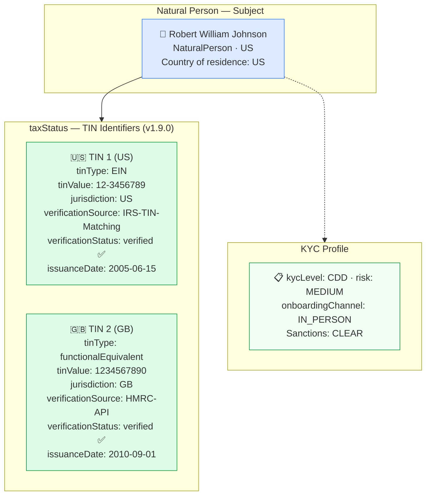

# tax/tax-individual-tin.json — Structure Diagram

**Scenario:** Individual Natural Person — Dual-Country TIN Identifiers (v1.9.0).  
Robert William Johnson (US-resident) holds both a US EIN (`12-3456789`, IRS-verified) and a UK functional-equivalent TIN (`1234567890`, HMRC API-verified). The `taxStatus.tinIdentifiers[]` array captures multi-jurisdictional tax identification — critical for FATCA withholding determination and CRS self-certification under OECD CRS Art. 6.

## TIN Identifiers Summary

| # | Jurisdiction | `tinType` | `tinValue` | Verification | Date |
|---|---|---|---|---|---|
| 1 | US | `EIN` | `12-3456789` | IRS-TIN-Matching ✅ | 2005-06-15 |
| 2 | GB | `functionalEquivalent` | `1234567890` | HMRC-API ✅ | 2010-09-01 |

## Key Data Points

| Field | Value |
|---|---|
| Schema | OpenKYCAML v1.9.0 |
| Subject | Robert William Johnson (US) |
| Tax identifiers | 2 TINs — US EIN + GB functional equivalent |
| FATCA relevance | US person — FATCA withholding applies; EIN required |
| CRS relevance | GB tax residency — CRS self-certification required |
| Risk | MEDIUM |
| Regulatory basis | FATCA (IRC §§1471-1474); OECD CRS Art. 6; AMLR Art. 22 |
