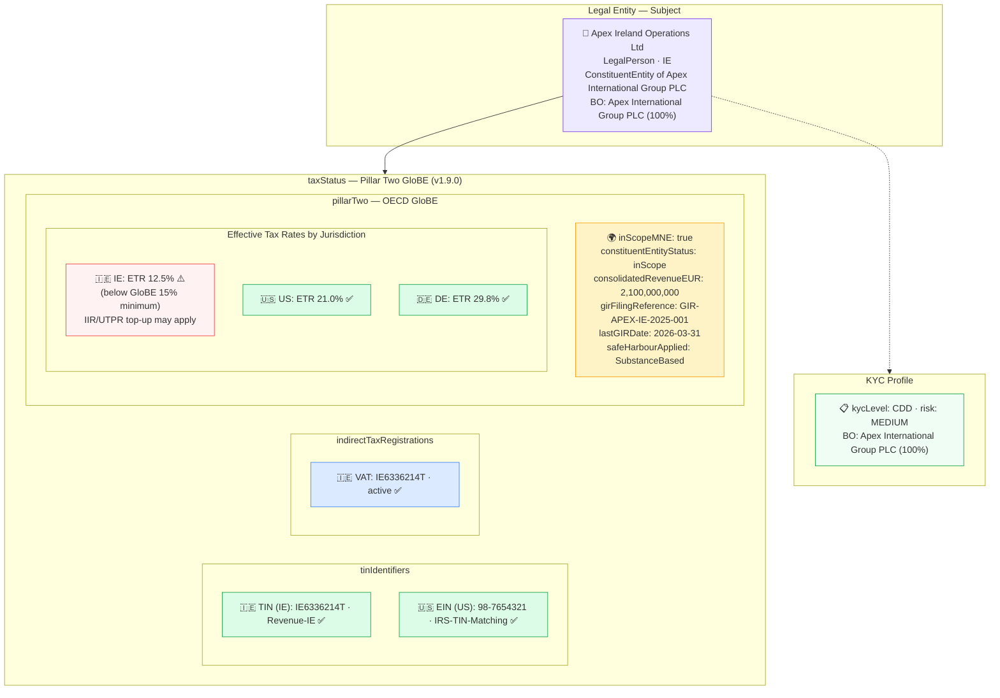

# tax/tax-mne-pillar2.json — Structure Diagram

**Scenario:** Multinational Enterprise — OECD Pillar Two GloBE Compliance (v1.9.0).  
Apex Ireland Operations Ltd (IE) is an in-scope Pillar Two constituent entity of Apex International Group PLC (consolidated revenue €2.1 billion). The `taxStatus.pillarTwo` block captures ETRs across three jurisdictions (IE 12.5%, US 21%, DE 29.8%), the Global Information Return (GIR) filing reference, and the substance-based `safeHarbourApplied`. IE rate of 12.5% is below the GloBE 15% minimum — potential IIR/UTPR top-up applies.

## Pillar Two ETR Summary

| Jurisdiction | ETR | GloBE 15% test | Action |
|---|---|---|---|
| IE | 12.5% | ❌ Below threshold | IIR/UTPR top-up potentially applicable |
| US | 21.0% | ✅ Above threshold | No top-up |
| DE | 29.8% | ✅ Above threshold | No top-up |

## Key Data Points

| Field | Value |
|---|---|
| Schema | OpenKYCAML v1.9.0 |
| Subject | Apex Ireland Operations Ltd (IE) |
| Parent MNE | Apex International Group PLC |
| Consolidated revenue | €2.1 billion (in-scope — above €750m threshold) |
| GIR reference | `GIR-APEX-IE-2025-001` (filed 2026-03-31) |
| Safe harbour | `SubstanceBased` |
| IE ETR | 12.5% — ⚠️ below GloBE 15% minimum |
| Risk | MEDIUM |
| Regulatory basis | OECD Pillar Two GloBE Rules (Dec 2021); EU GloBE Directive 2022/2523; AMLR Art. 22 |
