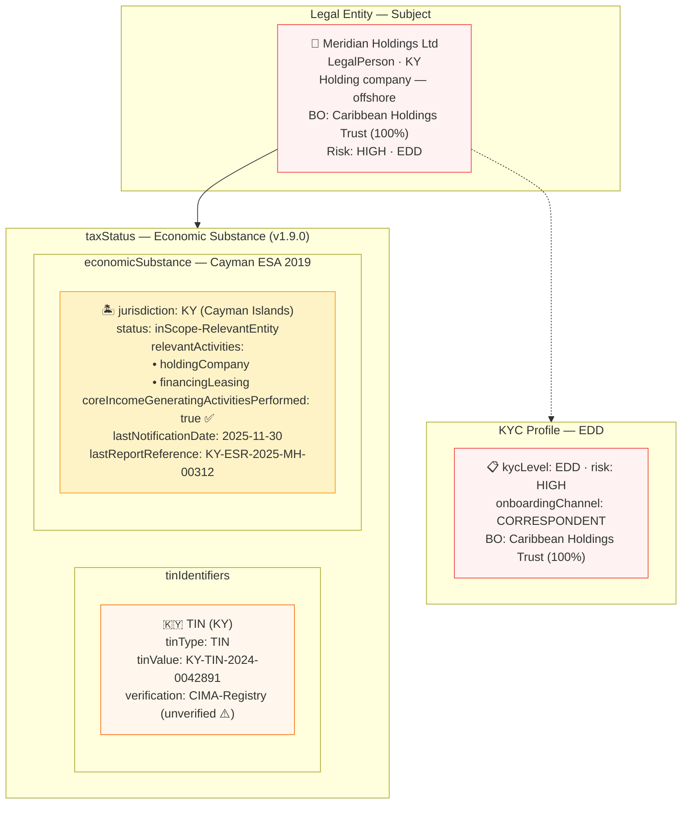

# tax/tax-offshore-esr.json — Structure Diagram

**Scenario:** Offshore Holding Company — Economic Substance Requirements (v1.9.0).  
Meridian Holdings Ltd (KY) is a Cayman Islands holding company subject to the Economic Substance Act 2019 (ESA). The `taxStatus.economicSubstance` block records: relevant activities (holding + financing/leasing), substance status (`inScope-RelevantEntity`), last ESR notification date (2025-11-30), and the CIMA report reference. Customer is rated HIGH risk with EDD.

## Economic Substance Fields

| Field | Value | Notes |
|---|---|---|
| `jurisdiction` | `KY` | Cayman Islands ESA 2019 |
| `status` | `inScope-RelevantEntity` | Subject to full ESR test |
| `relevantActivities` | `holdingCompany`, `financingLeasing` | Both in-scope activity types |
| `coreIncomeGeneratingActivitiesPerformed` | `true` | ESR test passed |
| `lastNotificationDate` | `2025-11-30` | Annual CIMA notification |
| `lastReportReference` | `KY-ESR-2025-MH-00312` | CIMA economic substance report |
| TIN verification | `unverified` | ⚠️ CIMA-Registry — manual verification required |

## Key Data Points

| Field | Value |
|---|---|
| Schema | OpenKYCAML v1.9.0 |
| Subject | Meridian Holdings Ltd (KY) |
| ESR status | In-scope — holding + financing/leasing |
| Last ESR report | KY-ESR-2025-MH-00312 (Nov 2025) |
| UBO | Caribbean Holdings Trust (100%) — trust-held |
| Risk | HIGH · EDD (offshore + trust-owned) |
| Regulatory basis | Cayman Islands ESA 2019; OECD BEPS Action 5; AMLR Art. 22/26 |
