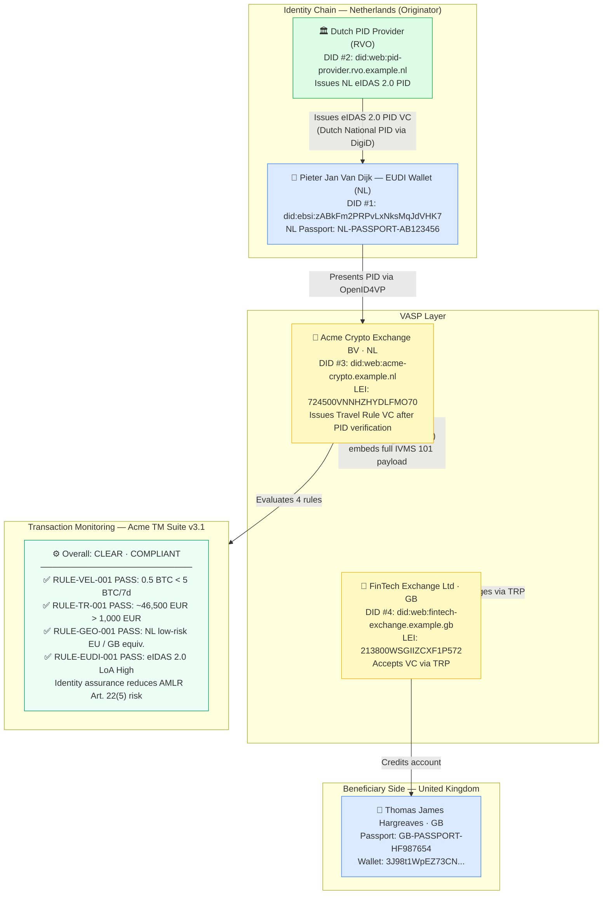
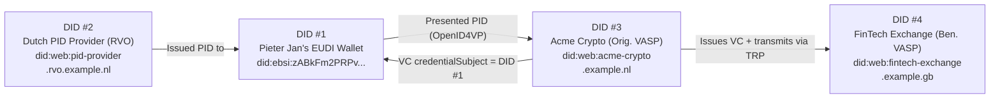

# travel-rule-vc-eudi-wallet.json — Structure Diagram

**Scenario:** EUDI Wallet Travel Rule VC — Full VC wrapper with EUDI PID, transaction monitoring and multi-DID triangulation.  
Pieter Jan Van Dijk (NL) sends 0.5 BTC to Thomas James Hargreaves (GB). Pieter Jan presents his Dutch EUDI Wallet PID at Acme Crypto. The IVMS 101 payload is VC-wrapped, signed by the originating VASP, and acknowledged by the beneficiary VASP via TRP.

## Multi-DID Triangulation

## Key Data Points

| Field | Value |
|---|---|
| Schema | OpenKYCAML v1.3.0 |
| VC type | TravelRuleAttestation (EUDI Wallet) |
| Originator | Pieter Jan Van Dijk (NL) — Dutch EUDI Wallet PID |
| Beneficiary | Thomas James Hargreaves (GB) |
| Asset / Amount | 0.5 BTC (~46,500 EUR) |
| Travel Rule | COMPLIANT, threshold 1,000 EUR (NL) |
| Identity assurance | eIDAS 2.0 LoA High — AMLR Art. 22(5) |
| TM rules | 4 PASS — CLEAR |
| Transmission | TRP (Travel Rule Protocol) |
