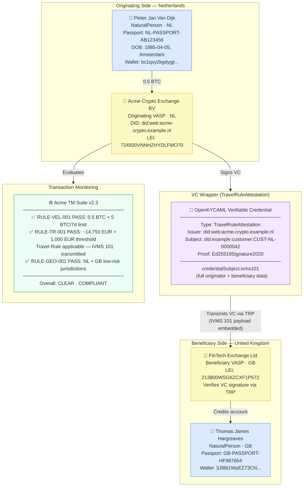

# travel-rule-vc-wrapped.json — Structure Diagram

**Scenario:** Travel Rule VC-Wrapped with Transaction Monitoring.  
Pieter Jan Van Dijk (NL) sends 0.5 BTC to Thomas James Hargreaves (GB). The full IVMS 101 payload is wrapped inside a W3C Verifiable Credential, signed by the originating VASP and transmitted to the beneficiary VASP. Transaction monitoring evaluates three rules.

## Key Data Points

| Field | Value |
|---|---|
| Schema | OpenKYCAML v1.3.0 |
| Message type | VC-wrapped IVMS 101 |
| VC type | TravelRuleAttestation |
| Originator | Pieter Jan Van Dijk, NL |
| Beneficiary | Thomas James Hargreaves, GB |
| Asset / Amount | 0.5 BTC (~14,750 EUR) |
| Travel Rule threshold | 1,000 EUR (NL jurisdiction) |
| Compliance status | COMPLIANT |
| TM outcome | CLEAR (3 rules PASS) |
| Transmission protocol | TRP (Travel Rule Protocol) |
