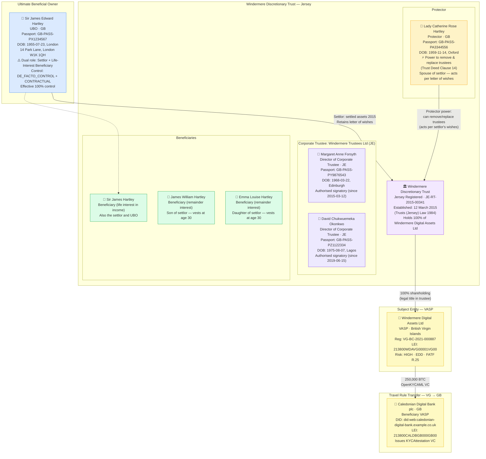
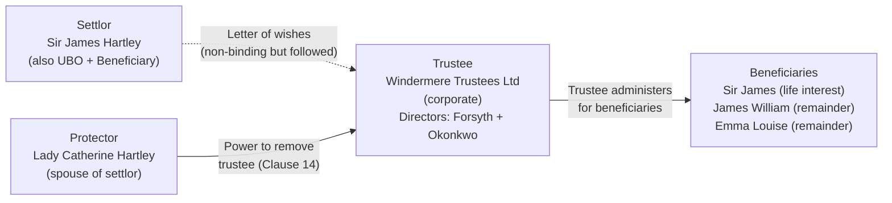

# trust-complex-ubo.json — Structure Diagram

**Scenario:** Discretionary Trust Beneficial Ownership — Jersey Discretionary Trust with Corporate Trustee, Named Protector, Settlor and Beneficiaries.  
Windermere Digital Assets Ltd (BVI VASP) is 100% owned by the Windermere Discretionary Trust (Jersey). Sir James Hartley is the UBO through a combination of settlor reservation rights and protector influence. All four FATF R.25 trust principal categories are captured in `lpid.mandates`.

## FATF R.25 Trust Principal Categories

## Key Data Points

| Field | Value |
|---|---|
| Schema | OpenKYCAML v1.3.0 |
| Structure | Jersey Discretionary Trust (1984 Law) |
| Subject VASP | Windermere Digital Assets Ltd (BVI) |
| UBO | Sir James Edward Hartley (GB) — settlor + life beneficiary |
| Control mechanism | DE_FACTO_CONTROL (settlor rights + protector influence) |
| Trustee | Windermere Trustees Ltd — 2 natural person directors |
| Protector | Lady Catherine Hartley — removal/replacement power |
| Beneficiaries | 3 (Sir James life interest; 2 children remainder) |
| Asset / Amount | 250,000 BTC |
| Beneficiary VASP | Caledonian Digital Bank plc (GB) |
| Risk | HIGH · EDD |
| Regulatory basis | FATF Recommendation 25, AMLR Art. 26(2)(b) |
